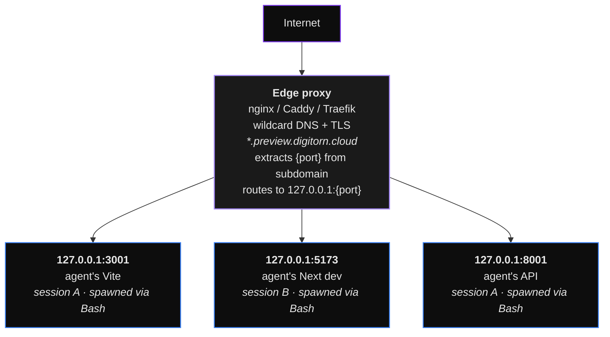

# Preview cloud deployment

How to run `web_preview` in a multi-tenant cloud where the daemon
sits on a server and users connect from their browsers somewhere
else.

## The architecture in one diagram



The **daemon** runs on the same host as the agents' dev servers and
talks to them over loopback. The **edge proxy** is the only public
ingress; it terminates TLS, extracts the per-attachment port from the
subdomain, and proxies to the right loopback port. The **daemon
never sees the user's browser traffic for previews** - it only emits
the iframe URL and the browser connects there directly via the edge
proxy.

## What you need

1. A wildcard DNS record:
   ```
   *.preview.digitorn.cloud   A   <daemon-host-ip>
   ```
2. A wildcard TLS cert covering `*.preview.digitorn.cloud` (Let's
   Encrypt DNS-01 with `certbot`, AWS ACM with Route53, etc.).
3. An edge proxy (nginx / Caddy / Traefik) on the daemon host that
   routes by subdomain.
4. A daemon config setting:
   ```yaml
   # ~/.digitorn/config.yaml
   web_preview:
     public_url_template: "https://preview-{port}.preview.digitorn.cloud"
   ```

The daemon resolves attachments to URLs using the template; the
edge proxy resolves URLs to loopback ports.

## nginx example config

```nginx
# /etc/nginx/sites-available/preview.digitorn.cloud
server {
    listen 443 ssl http2;
    server_name ~^preview-(?<preview_port>\d+)\.preview\.digitorn\.cloud$;

    ssl_certificate     /etc/letsencrypt/live/preview.digitorn.cloud/fullchain.pem;
    ssl_certificate_key /etc/letsencrypt/live/preview.digitorn.cloud/privkey.pem;

    # Loopback per-attachment routing. {preview_port} comes from the
    # subdomain regex above.
    location / {
        proxy_pass http://127.0.0.1:$preview_port;
        proxy_set_header Host $host;
        proxy_set_header X-Real-IP $remote_addr;
        proxy_set_header X-Forwarded-For $proxy_add_x_forwarded_for;
        proxy_set_header X-Forwarded-Proto https;
        proxy_http_version 1.1;
        # WebSocket upgrade for HMR (next/webpack-hmr, vite/@vite/client).
        proxy_set_header Upgrade $http_upgrade;
        proxy_set_header Connection "upgrade";
        # Long timeouts so HMR connections don't get cut.
        proxy_read_timeout 86400s;
        proxy_send_timeout 86400s;
        # Don't buffer streaming responses (SSE, large bundles).
        proxy_buffering off;
    }
}

server {
    listen 80;
    server_name *.preview.digitorn.cloud;
    return 301 https://$host$request_uri;
}
```

Reload: `sudo nginx -t && sudo systemctl reload nginx`.

## Caddy example config (simpler)

```caddy
# /etc/caddy/Caddyfile
preview-{port}.preview.digitorn.cloud {
    reverse_proxy 127.0.0.1:{port}
}
```

Caddy auto-handles TLS via Let's Encrypt + wildcard if your DNS
provider has a plugin (Cloudflare, Route53, …).

## Local end-to-end smoke test (no real DNS needed)

You can rehearse the cloud flow on your dev machine before pushing.

### 1. Add fake hostnames to `/etc/hosts`

```
# /etc/hosts (need sudo)
127.0.0.1   preview-3001.preview.digitorn.cloud
127.0.0.1   preview-3002.preview.digitorn.cloud
127.0.0.1   preview-5173.preview.digitorn.cloud
```

(or use a wildcard via dnsmasq / Acrylic on Windows)

### 2. Run nginx locally with the same regex routing

```bash
# install nginx, drop the config above (but use a self-signed cert
# or just plain http on port 80 for the test), reload.
```

### 3. Spawn a fake dev server

```bash
python -m http.server 3001 &
```

### 4. Configure daemon

```yaml
# ~/.digitorn/config.yaml
web_preview:
  public_url_template: "http://preview-{port}.preview.digitorn.cloud"
```

Restart daemon.

### 5. Curl the test

```bash
curl -v http://preview-3001.preview.digitorn.cloud/
# → should hit nginx → forward to 127.0.0.1:3001 → return python's
#   http.server directory listing.
```

### 6. Test via the daemon's iframe routing

In a browser, open the agent app, get the agent to `PreviewProxy(port=3001)`
(or curl the endpoint), then verify the iframe loads from
`http://preview-3001.preview.digitorn.cloud/...` - you should see
the python http.server response inside the iframe.

## Smoke script (run after deployment)

`scripts/check-preview-cloud.sh`:

```bash
#!/usr/bin/env bash
set -e

DAEMON_HOST="${1:-https://daemon.digitorn.cloud}"
WILDCARD_BASE="${2:-preview.digitorn.cloud}"

echo "==> Daemon health"
curl -fsS "$DAEMON_HOST/<liveness-path>" | jq .

echo
echo "==> Web-preview module health"
curl -fsS "$DAEMON_HOST/<web-preview-health-path>" | jq .

echo
echo "==> Wildcard DNS resolves"
nslookup "preview-9999.$WILDCARD_BASE" | tail -3

echo
echo "==> Wildcard cert valid"
echo | openssl s_client -servername "preview-9999.$WILDCARD_BASE" \
    -connect "preview-9999.$WILDCARD_BASE":443 2>/dev/null \
    | openssl x509 -noout -dates -subject

echo
echo "==> Edge proxy responds (on a port that probably has no listener)"
curl -sI "https://preview-9999.$WILDCARD_BASE/" | head -1
# Expected: 502 / 504 (nothing on that port). 200 OR 301/302 means
# it's NOT proxying through (some default page). Anything else
# (e.g. SSL handshake error) flags a config issue.
```

Run it after every deploy:

```bash
bash scripts/check-preview-cloud.sh https://daemon.digitorn.cloud preview.digitorn.cloud
```

## Sizing / capacity

- **One TCP port per active proxy attachment.** Pick a port range
  (e.g. 4000–9999 = 6000 ports = 6000 concurrent dev servers max).
- **Each Node-based dev server is ~150 MB RAM.** Cap users / sessions
  to fit your host's memory.
- **Idle reaper** drops attachments after 30 min of no HTTP. The
  bash task is killed too if `bash_task_id` was passed to `PreviewProxy`.
  Without that, the dev server runs forever (until session ends).
- **Per-user / per-session limits** are baked in:
  ```python
  _MAX_ATTACHMENTS_PER_SESSION = 5
  _MAX_ATTACHMENTS_PER_USER = 20
  ```
  Tune via the config or environment if your usage pattern differs.

## Security notes

- The dev server is **publicly reachable** over the internet (via the
  edge proxy's wildcard subdomain). Anyone with the URL hits it.
- The `?session_id=X&token=Y` query params in the iframe URL are the
  unguessable handle - they're scoped per session and rotated via
  attach.
- For sensitive workloads (private codebases, internal APIs), have
  the agent's app validate the token (the Digitorn Preview SDK
  already does this).
- The nginx config above doesn't add auth. If you want only
  logged-in users to reach previews, add an `auth_request`
  directive pointing at the daemon's auth-verify endpoint
  (consult your daemon administrator for the exact path).

## Troubleshooting

| Symptom | Likely cause | Fix |
|---|---|---|
| iframe shows blank, no console errors | DNS not propagating yet | `dig preview-3001.preview.digitorn.cloud` to verify; wait 60s |
| 502 on every preview URL | Edge proxy can't reach loopback | Verify nginx routing regex captures the port; check `netstat` for listener |
| HMR WebSocket fails | nginx missing `Connection: upgrade` headers | Ensure the config above is loaded; check `nginx -T` |
| Mixed content warnings | Edge proxy serves HTTPS but dev server emits HTTP-relative URLs | Force HTTPS in `proxy_set_header X-Forwarded-Proto https` (already in template) |
| Wildcard cert errors | Cert covers `daemon.digitorn.cloud` only, not subdomains | Reissue with `*.preview.digitorn.cloud` in SAN |
| Limit hit (refused: 5 / session) | Agent leaks attachments | Have agent call `PreviewDetach`; check `/health/web_preview` for the `count` field |
