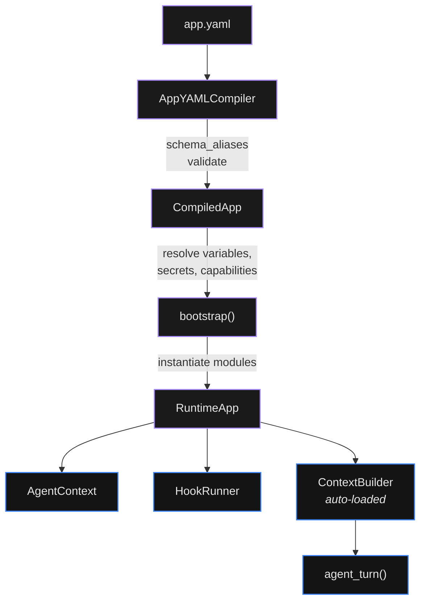

Digitorn apps are declared in a single YAML file. The compiler parses
that YAML into the root model
 and the daemon runs it.

There is **one canonical schema (v2)** with **8 top-level blocks**.
Every field has exactly one home; legacy flat YAMLs (`execution:`,
`modules:` at the top level, ...) are still accepted by an alias pass
that reshapes them to canonical before validation.

The optional `schema_version: 2` declaration at the top of the file
future-proofs against breaking changes.

## The 8 blocks

| Block | Required | What it holds | Doc |
|-------|----------|---------------|-----|
| `app:` | **Yes** | Identity - `app_id`, `name`, `version`, `icon`, `color`, `tags`, `quick_prompts`. | [App Configuration](02-app-config.md) |
| `runtime:` | No (defaults) | Lifecycle - `mode`, `entry_agent`, `max_turns`, `timeout`, `triggers`, `hooks`, `middleware`, `pipeline`, `context`, `workdir`, `default_channel`. | [App Configuration](02-app-config.md), [Triggers](09-triggers.md), [Middleware](17-middleware.md), [Tool Hooks](31-tool-hooks.md), [Context Management](06-context-management.md) |
| `agents:` | At least 1 in practice | List of agents. Each has `id`, `role`, `brain`, `system_prompt`, `modules`, `pool`, `delegate_to`. | [Agents](03-agents.md), [Multi-Agent](12-multi-agent.md) |
| `tools:` | No | What the agent can call: `modules` (dict), `capabilities` (grant / deny), `channels` (dict). | [Tools](04-tools.md), [Built-in Tools](04b-builtin-tools.md), [MCP Servers](04d-mcp.md), [Channels](40-channels.md), [Security](11-security.md) |
| `security:` | No | Runtime boundaries: `behavior`, `sandbox`, `credentials_schema`. | [Behavior Engine](43-behavior.md), OS Sandbox, [credentials.md](../reference/runtime/credentials.md) |
| `ui:` | No | Pure display, never read by the daemon: `theme`, `features`, `widgets`, `workspace` (renderer), `slash_commands`, `quick_prompts`, `greeting`. (`ui.preview` is deprecated; use `tools.modules.web_preview` for iframe-preview attachments.) | [Client Manifest](44-client-manifest.md), Widgets, Workspace & Preview |
| `dev:` | No | Developer affordances: `skills`, `variables`, `include` (fragmentation). | [Skills System](21-skills.md), [Bundle namespaces](38-bundle-namespaces.md) |
| `flow:` | No | Optional declarative orchestration graph for multi-agent apps. Top-level since v2 because it changes how agents coordinate (explicit scenography vs implicit `Agent()` calls). | [Flows](07-flows.md) |

The `ui.workspace` block (renderer) is a different concept from
`runtime.workdir` (filesystem path). The schema renames the legacy
`execution.workspace` to `runtime.workdir` to remove the ambiguity
(see `RuntimeBlock.workdir`).

## Quick example

This example uses a local Ollama model so no external credentials
are required. Replace the brain block to use any other provider
(`provider: openai`, `provider: anthropic`, `provider: deepseek`,
etc.); see [Agents](03-agents.md) for the full list.

```yaml
app:
  app_id: my-assistant
  name: My Assistant

runtime:
  mode: conversation

agents:
  - id: assistant
    role: assistant
    brain:
      provider: ollama
      model: qwen25-7b-gpu:latest
      backend: openai_compat
      config:
        base_url: http://localhost:11434/v1
        api_key: ollama
    system_prompt: |
      You are a helpful assistant. Reply concisely.

tools:
  modules:
    memory:
      config:
        auto_remember: false
  capabilities:
    default_policy: auto
    grant:
      - module: memory
        actions: [remember]

ui:
  greeting: "Hello! How can I help?"
```

Deploy and chat with it:

```bash
digitorn start                                 # daemon if not running
digitorn install my-assistant.yaml             # deploy + arm triggers
digitorn dev chat my-assistant -m "Hi there!"  # talk to it
```

## Migration from the legacy flat shape

If your YAML has `execution:`, `modules:`, `channels:`, `behavior:`, ...
at the top level, the compiler still accepts it via the alias pass. The bidirectional
mirror means both shapes work at read time.

The compiler handles legacy flat-shape YAMLs automatically via the alias
pass · no migration command needed. The bidirectional
mirror means both shapes work at read time.

To rewrite a file in-place to the canonical 8-block form, the compiler
also accepts the result directly; simply save in the new shape.

Field renames the migrator applies (no compat retention). Each row
shows the legacy v1 path on the left and the v2 canonical path on
the right:

| Legacy v1 | Canonical v2 |
|--------|-----------|
| `execution.workspace` | `runtime.workdir` |
| `execution.workspace_mode` | `runtime.workdir_mode` |
| `execution.greeting` | `ui.greeting` |
| `execution.sandbox` | `security.sandbox` |
| `execution.credentials_schema` | `security.credentials_schema` |
| `dependencies.variables` | `dev.variables` |
| `dependencies.channels` | `tools.channels` |
| `dependencies.credentials` | `security.credentials_schema` |
| `dependencies.payload` | `runtime.payload_schema` |

Top-level lifts (legacy → canonical home, fields keep their name):

| Legacy top-level (v1) | Canonical (v2) |
|------------------|-----------|
| `modules:` | `tools.modules` |
| `capabilities:` | `tools.capabilities` |
| `channels:` | `tools.channels` |
| `behavior:` | `security.behavior` |
| `widgets:` | `ui.widgets` |
| `workspace:` (block at root) | `ui.workspace` (renderer) |
| `preview:` | `ui.preview` (deprecated, ignored at deploy - use `tools.modules.web_preview`) |
| `theme:` | `ui.theme` |
| `features:` | `ui.features` |
| `slash_commands:` | `ui.slash_commands` |
| `skills:` | `dev.skills` |
| `variables:` | `dev.variables` |
| `include:` | `dev.include` |
| `middleware:` | `runtime.middleware` |
| `pipeline:` | `runtime.pipeline` |
| `flow:` (in v1 was top-level too, but is now strictly canonical) | `flow:` (top-level, NOT under runtime) |

Everything that was under `execution:` (`mode`, `triggers`, `hooks`,
`max_turns`, `timeout`, `session_mode`, `direct_modules`,
`tool_injection`, `default_channel`, `context`, `payload_schema`,
`watchers`, `scheduler`, ...) lifts to `runtime:` with the same name.
`security.sandbox` → `security.sandbox`,
`security.credentials_schema` → `security.credentials_schema`,
`ui.greeting` → `ui.greeting`.

## Documentation by topic

### Getting started

- [Getting Started](01-getting-started.md) - install, first app, run loop
- [App Configuration](02-app-config.md) - exhaustive reference for the 8 blocks
- [Examples](15-examples.md) - complete real-world apps

### Agents and tools

- [Agents](03-agents.md) - agent definition, brain, providers, fallback
- [Multi-Agent](12-multi-agent.md) - coordinator + specialists, `agent_spawn`, isolation
- [Tools](04-tools.md) - adaptive tool injection, discovery, semantic search
- [Built-in Tools](04b-builtin-tools.md) - delegation, memory, todo, messaging
- [Execution Primitives](04c-primitives.md) - parallel execution, watchers, scheduler
- [MCP Servers](04d-mcp.md) - connect external MCP servers, sandbox, OAuth2
- [Web Module](19-web.md) - search + fetch + parse
- [LSP Diagnostics](27-lsp.md) - real-time code diagnostics

### Memory and context

- [Cognitive Memory](05-memory.md) - working memory, tasks, notes, facts
- [Context Management](06-context-management.md) - compaction, summary brain, hooks
- [Advanced RAG](37-rag.md) - hybrid retrieval, citations, semantic cache, Text2SQL

### Runtime control

- [Triggers](09-triggers.md) - cron, watch, http (background mode)
- [Flows](07-flows.md) - declarative orchestration graph
- [Middleware Pipeline](17-middleware.md) - secret masking, content filter, RAG inject
- [Tool Hooks](31-tool-hooks.md) - pre/post hooks around tool calls
- [Skills System](21-skills.md) - `/commit`, `/review`, custom commands
- [Channels (Bidirectional I/O)](40-channels.md) - webhooks, cron, email, RSS
- [Background Sessions](38-background-sessions.md) - mono / multi session modes
- [Macros](08-macros.md) - reusable YAML fragments
- [Composition](22-composition.md) - referencing other apps
- [Rules](33-rules.md) - modular project instructions

### Security

- [Capabilities](11-security.md) - `default_policy`, grant / deny, approve gates
- [Behavior Engine](43-behavior.md) - declarative runtime rules + classifier
- OS Sandbox - Landlock, seccomp, Seatbelt, Job Objects
- [Auth](22-auth.md) - JWT, per-user installs

### UI and client

- [Client Manifest](44-client-manifest.md) - `features`, `theme`, `slash_commands`
- Widgets - declarative UI primitives
- Workspace & Preview - virtual filesystem streamed to the client
- Preview SDK - `@digitorn/preview-sdk` React package: hooks, components, host protocol, hidden namespaces
- [Bundle namespaces](38-bundle-namespaces.md) - `{{prompt.X}}`, `{{include:}}`, hot reload

### Operating and deploying

- [Daemon Configuration](23-configuration.md) - server, KV, database, CORS
- [Observability & Monitoring](24-observability.md) - metrics, health, tracing
- [Production Deployment](36-production.md) - TLS, rate limiting, hardening
- [Multi-Tenant Installs](45-multi-tenant.md) - per-user vs system-wide
- [Bundle namespaces](38-bundle-namespaces.md) - fragmentation, i18n, hot reload
- [Dev CLI](46-dev-cli.md) - test against the real daemon
- [API Integration](14-api-integration.md) - REST + Socket.IO contracts
- [Expressions](10-expressions.md) - template language

## Modules

The daemon ships **23 agent-facing modules**:

`agent_spawn`, `behavior`, `channels`, `context_builder`, `cron_native`,
`database`, `dev_tools`, `filesystem`, `http`, `index`, `llm_provider`,
`lsp`, `mcp`, `memory`, `preview`, `queue`, `rag`, `shell`, `vector`,
`web`, `web_preview`, `widget`, `workspace`.

`packages/digitorn/modules/cron` also ships but is a system-only
scheduler; it is not listed in the
[module reference](/docs/reference/modules/).

`context_builder` and `llm_provider` are auto-loaded; you never
declare them under `tools.modules`. Per-module reference docs live
under [reference/modules/](/docs/reference/modules/).

## Architecture



The compiler walks the YAML once, validates the eight
blocks, then bootstraps each declared module. Once running, every tool
call goes through the `AgentContext`, hooks fire around it via
`HookRunner`, and `ContextBuilder` decides what tool schemas reach the
LLM (direct vs discovery vs compact).

### Tool delivery - direct, compact, or discovery

The `ContextBuilder` module exposes meta-tools the agent can use to
discover capabilities lazily:

- **direct** - full tool schemas injected up front. Best for small
  apps (< ~30 tools).
- **compact_direct** - tool names + 1-line descriptions, full schema
  on demand via `get_tool`.
- **discovery** - only `list_categories`, `browse_category`,
  `search_tools`, `get_tool`, `execute_tool` injected. Agent walks
  the tree as needed. Scales to hundreds of tools.

The mode is auto-detected by the compiler based on tool count, or
forced via `runtime.tool_injection`.

### LLM compatibility

Three backends are supported
(agents[].brain.backend). The three backends are `openai_compat` (default), `anthropic`, and `github_copilot`.

- `openai_compat` - any OpenAI-compatible `/v1` endpoint
  (OpenAI, DeepSeek, Groq, Mistral, Together, Ollama, vLLM, LM Studio,
  OpenRouter, Cerebras, Perplexity, Fireworks, xAI, Gemini, ...).
- `anthropic` - Anthropic SDK (also accepts the `claude-code` API-key
  alias for Claude Code OAuth tokens, see
  [llm_provider module](../reference/modules/llm_provider.md)).
- `github_copilot` - uses your GitHub Copilot subscription.

Models that support **native tool calling** (OpenAI, Anthropic,
DeepSeek, Groq, Mistral, Together) get tools via the API
`tools=` parameter. Models that don't (Ollama, LM Studio, vLLM, small
local models) get tool schemas injected into the system prompt; tool
calls are parsed from the text output via a multi-format recovery
parser.

\n```bash\n# Auth\ndigitorn login                     # OAuth sign-in via browser\ndigitorn logout                    # wipe local credentials\ndigitorn whoami                    # current user info\n\n# App lifecycle\ndigitorn install <app.yaml>        # install an app from YAML\ndigitorn list                      # list installed apps\ndigitorn uninstall <app-id>        # remove an app\ndigitorn enable <app-id>           # enable a disabled app\ndigitorn disable <app-id>          # disable an active app\ndigitorn app-reload <app-id>       # reload an app from disk\ndigitorn app-info <app-id>         # show app details\ndigitorn app-status <app-id>       # show app health checks\n\n# Secrets\ndigitorn secret list <app-id>      # list secret keys\ndigitorn secret get <app-id> <key>  # get a secret value\ndigitorn secret set <app-id> <key>  # set a secret (value from arg or stdin)\ndigitorn secret delete <app-id> <key> # delete a secret\n\n# Chat\ndigitorn chat <app-id>             # interactive TUI chat\ndigitorn chat <app-id> -s <sid>    # resume a specific session\ndigitorn sessions <app-id>         # list recent sessions\n\n# Daemon\ndigitorn daemon-stats               # daemon statistics\n```\n

`digitorn` prints help. For systemd / launchd
/ Windows service installation, see
[Production Deployment](36-production.md).
