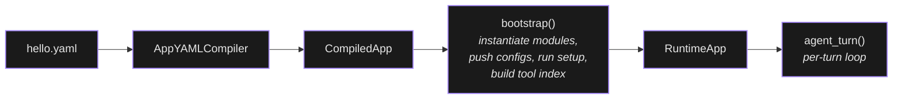

# Getting Started

The shortest path from a fresh install to a chat reply is roughly
two minutes. You write a YAML, the daemon compiles it, and you talk
to it from the terminal.

You'll need Digitorn itself (download from the releases page or build
from source), and a way for the agent to call an LLM. That last part
can be a cloud API key (DeepSeek, OpenAI, Anthropic, Groq…) or a local
model server such as Ollama, LM Studio, or vLLM. The example below
picks the local route, so a running Ollama is enough.

## Your first app

Save the following as `hello.yaml`. The `brain` block points at a
local Ollama model so nothing leaves the machine; if you'd rather
use a cloud provider, the [providers](#using-different-providers)
section further down has drop-in replacements.

```yaml
app:
  app_id: hello
  name: "Hello App"
  description: "My first Digitorn app"

runtime:
  mode: conversation

agents:
  - id: assistant
    role: assistant
    brain:
      provider: ollama
      model: qwen25-7b-gpu:latest
      backend: openai_compat
      config:
        base_url: http://localhost:11434/v1
        api_key: ollama
    system_prompt: |
      You are a friendly assistant. Answer questions concisely.

tools:
  modules:
    memory:
      config:
        auto_remember: false
  capabilities:
    default_policy: auto
    grant:
      - module: memory
        actions: [remember]

ui:
  greeting: "Hello! I'm your assistant. Ask me anything."
```

If you'd rather use a cloud provider, drop in one of the `brain`
blocks from [Using different providers](#using-different-providers)
and export the matching API key.

## Running the app

`digitorn install` compiles, validates and installs apps.  
`digitorn install hello.yaml` pushes the YAML
through `AppYAMLCompiler` and reports errors before any bootstrap
happens. A green checkmark means the app
definition is structurally sound; runtime issues (a service that's
down, a file that isn't where you expected) can still happen, but
the YAML itself is correct. `install` also deploys the app and arms
any background triggers the YAML declares.

To talk to the app from the terminal:

```bash
digitorn chat hello                                       # interactive
digitorn chat hello -m "Say hello in three languages"     # one-shot
```

`digitorn chat` auto-approves any pending capability prompt, so
it's the simplest way to test a deployed app end-to-end.

## What validation checks

Compile-time validation is fairly thorough, which is why so many
classes of bug never reach runtime. The YAML must parse as a mapping
at the root, then every block is validated with
`extra: forbid`, so types, required fields, literal sets, and value
ranges are all enforced. Each `{{…}}` reference has to resolve, and
a missing `{{env.X}}` is a compile error (use the `??` fallback
operator if you want an optional value).

The compiler also checks identifiers against the catalog: the
`brain.provider` value must be in the known set (it
produces a "Did you mean…" suggestion on a typo); every
key under `tools.modules` must match a registered module; every
`setup[].action` must exist on its module, with its `params`
validated against the action's param schema. Capabilities
(`tools.capabilities.grant`, `approve`, `deny`, `hidden_actions`)
are compiled into a `SecurityProfile`, and the
`agents[].modules` shape is checked there too.

When `digitorn install` returns clean, the structural part is
done.

## How it works



Inside one turn, the system prompt and the user input are sent to
the LLM. The LLM replies with text, tool calls, or both. Each tool
call is routed through the context builder
(`context_builder.execute_tool`); the result streams back into
the next iteration. The loop ends when the LLM stops emitting tool
calls, or when `runtime.max_turns` is hit, whichever comes first.

## Execution modes

The same agent loop drives several `runtime.mode` settings, defined
in `RuntimeBlock`. The default is `conversation`,
which is what `hello.yaml` uses: an interactive multi-turn chat.
`one_shot` reads a single input from `runtime.input`, runs the
agent once, and returns it through `runtime.output`. `background`
hands control to the daemon, which triggers the agent on cron
schedules, file watchers, HTTP webhooks, RSS feeds, and the rest of
the connectors documented in [Triggers](09-triggers.md). And
`pipeline` chains multiple apps with `runtime.pipeline[]`. The
`one_shot` input/output contract is detailed in
[App Configuration → runtime](02-app-config.md#runtime---lifecycle-and-execution-policy).

## Using different providers

The `brain` block is the only thing that changes when you swap
providers; everything else in the YAML stays put. The cloud
providers all read their key from an environment variable through
the `{{env.X}}` template, except the Claude Code alias which
delegates to `~/.claude/.credentials.json`.

```yaml
# DeepSeek
brain:
  provider: deepseek
  model: deepseek-chat
  backend: openai_compat
  config:
    api_key: "{{env.DEEPSEEK_API_KEY}}"

# OpenAI
brain:
  provider: openai
  model: gpt-4o
  backend: openai_compat
  config:
    api_key: "{{env.OPENAI_API_KEY}}"

# Anthropic (native backend)
brain:
  provider: anthropic
  model: claude-sonnet-4-5
  backend: anthropic
  config:
    api_key: "{{env.ANTHROPIC_API_KEY}}"

# Anthropic via Claude Code OAuth
brain:
  provider: anthropic
  model: claude-sonnet-4-5
  backend: anthropic
  config:
    api_key: "claude-code"          # alias - reads ~/.claude/.credentials.json

# Groq (fast inference)
brain:
  provider: groq
  model: llama-3.3-70b-versatile
  backend: openai_compat
  config:
    api_key: "{{env.GROQ_API_KEY}}"
    base_url: "https://api.groq.com/openai/v1"
```

The validated provider hints and the model choices for each one
are listed in
[Agents → Validated provider hints](03-agents.md#validated-provider-hints).

For local model servers, the shape is the same; you point
`base_url` at the local endpoint and skip the API key.

```yaml
brain:
  provider: ollama
  model: qwen2.5:14b-instruct-q4_K_M
  backend: openai_compat
  config:
    base_url: "http://localhost:11434/v1"
  context:
    max_tokens: 8000
    strategy: truncate
    keep_recent: 6
```

By default Digitorn assumes a local model can't do native tool
calling, so it injects the tool schemas directly into the system
prompt and parses tool calls back out of the model's text output
(the recovery parser is described in
[Agents → Tool-call recovery](03-agents.md#tool-call-recovery)).
That's a safe default, but a few local builds (`qwen2.5-coder`,
some `llama-3.3-70b` Ollama builds) really do support native tool
calling. Flip `native_tool_use: true` on the brain block to use it:

```yaml
brain:
  provider: ollama
  model: qwen2.5-coder:7b
  native_tool_use: true
  config:
    base_url: "http://localhost:11434/v1"
```

## Useful CLI commands

The full CLI is documented in the [CLI Reference](/docs/reference/cli/).
The commands you'll actually use early on:

```bash
digitorn install <app.yaml>                  # install an app
digitorn list                                # list installed apps
digitorn uninstall <app-id>                  # remove an app

digitorn chat <app-id>                       # interactive TUI chat
digitorn chat <app-id> -m "message"          # one-shot
digitorn sessions <app-id>                   # list recent sessions
```
## Next steps

Once `hello.yaml` is running, the natural next page is
[App Configuration](02-app-config.md) for the full reference of
the eight blocks. From there, [Agents](03-agents.md) covers brain
fallback and multi-agent setups, [Tools](04-tools.md) explains how
tool schemas reach the LLM, and
[Context Management](06-context-management.md) goes into
compaction and token budgeting. [Examples](15-examples.md) has
end-to-end real apps if you'd rather learn by reading whole YAMLs.
