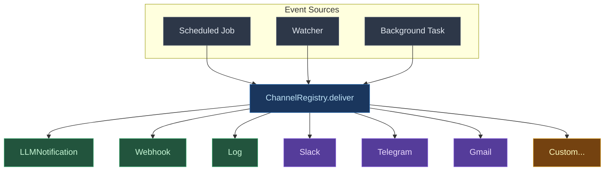
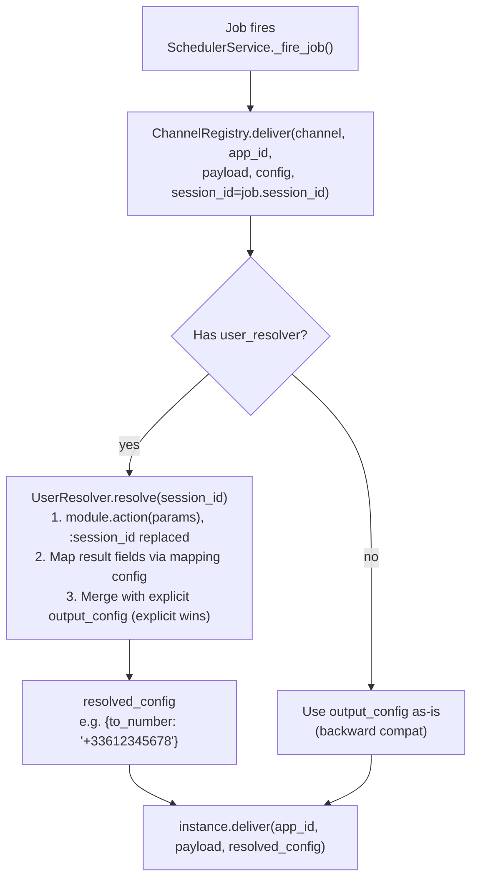

> **You probably want [Channels Module](40-channels.md).**
> The `channels` module is the unified bidirectional I/O surface
> (11 adapters, activation pipeline, reply context). This page
> covers only the **outbound delivery layer** for callers that
> need the low-level routing detail (`ChannelRegistry.deliver`,
> per-channel rendering, retry policy). If you're declaring
> channels from YAML, start with the module page.

Output channels are the **delivery layer** of the channels system. When a scheduled job fires, a watcher detects a change, or a background task completes, the result is routed through `ChannelRegistry.deliver` to an external destination.

The agent-facing surface (declaring channels in YAML, the activation pipeline, the inbound + outbound contracts) lives in the [Channels Module](40-channels.md) page. The content below is the implementation detail of the delivery path - mostly relevant to module authors and operators, not to app authors.

## Architecture



## Quick Start

### 1. Basic - LLM Notification (default, no config needed)

Every app has the `llm_notification` channel built-in It pushes notifications directly to the LLM agent's conversation:

```yaml
runtime:
  scheduler: true
  watchers: true
```
### 2. Add a Webhook Channel

```yaml
runtime:
  scheduler: true
  default_channel: slack_alerts
tools:
  channels:
    slack_alerts:
      type: webhook
      config:
        url: '{{env.SLACK_WEBHOOK_URL}}'
        headers:
          Content-Type: application/json
```
### 3. Multiple Channels

```yaml
runtime:
  scheduler: true
  watchers: true
  default_channel: slack_alerts
tools:
  channels:
    slack_alerts:
      type: webhook
      config:
        url: '{{env.SLACK_WEBHOOK}}'
    audit_log:
      type: log
      config:
        logger_name: digitorn.audit
        level: INFO
        format: json
        include_data: true
    ops_webhook:
      type: webhook
      config:
        url: https://ops.internal(daemon API)
        headers:
          Authorization: Bearer {{env.OPS_TOKEN}}
        timeout: 5
```
Then in the agent conversation, the LLM can target specific channels:

```
"Schedule a health check on https://api.example.com every 5 minutes,
 send alerts to ops_webhook"
```

## Built-in Channel Types

### `llm_notification` - LLM Agent (default)

Delivers notifications directly to the LLM agent's conversation loop. If no consumer is connected, notifications are buffered in the KV store and delivered when the session reconnects.

- **Always available** - no config needed, always registered
- **Zero external dependencies** - local memory + KV storage
- **Automatic fallback** - other channels fall back to this if they fail

```yaml
tools:
  channels: null
```
### `webhook` - HTTP POST

Send notifications via HTTP to any URL. Compatible with Slack Incoming Webhooks, Discord, Microsoft Teams, Zapier, Make, n8n, and any REST API.

```yaml
tools:
  channels:
    my_hook:
      type: webhook
      config:
        url: https://hooks.slack.com/services/T.../B.../...
        method: POST
        headers:
          Content-Type: application/json
        timeout: 10
        verify_ssl: true
        payload_template: '{"text": "{{message}}", "channel": "#alerts"}'
```
**Per-delivery overrides** (from `output_config` on jobs/watchers):

| Field | Description |
|-------|-------------|
| `url` | Override target URL |
| `headers` | Additional headers (merged with global) |
| `payload` | Custom payload dict (replaces template) |

**Retry policy**: 3 retries, exponential backoff 2s -- 30s. Retries on HTTP 429 (rate limit) and 5xx (server errors).

**Fallback**: If `aiohttp` is not installed, falls back to `urllib` (synchronous in thread pool).

### `log` - Structured Logging

Write notifications to the daemon's logging system. Useful for debugging, audit trails, and integration with log aggregation systems (ELK, Loki, Datadog, Grafana).

```yaml
tools:
  channels:
    audit:
      type: log
      config:
        logger_name: digitorn.notifications
        level: INFO
        format: json
        include_data: true
```
**No retry** - logging is local and effectively never fails.

## Plugin Channels

Anyone can create a channel plugin. Install via pip, it auto-registers:

```bash
install digitorn-channel-slack
install digitorn-channel-telegram
install digitorn-channel-gmail
install digitorn-channel-kafka
install digitorn-channel-sms
```

Then use it in YAML:

```yaml
tools:
  channels:
    team_slack:
      type: slack
      config:
        webhook_url: '{{secret.SLACK_WEBHOOK}}'
        default_channel: '#engineering'
```
### Creating a Plugin Channel

1. Create a Python package with a class extending `BaseOutputChannel`:

```python
from digitorn.core.app.channels import BaseOutputChannel, ChannelPayload, DeliveryResult

class TelegramChannel(BaseOutputChannel):
    CHANNEL_ID = "telegram"
    CHANNEL_NAME = "Telegram"
    CHANNEL_VERSION = "1.0.0"
    CHANNEL_DESCRIPTION = "Send notifications via Telegram Bot API"

    def capabilities(self):
        return ChannelCapabilities(
            supports_rich_text=True,
            max_message_length=4096,
            supported_formats=["text", "markdown", "html"],
        )

    def config_schema(self):
        return {
            "required": {
                "bot_token": "Telegram Bot API token (from @BotFather)",
            },
            "optional": {
                "default_chat_id": "Default chat/group ID",
                "parse_mode": "Message format: Markdown or HTML",
            },
        }

    def per_delivery_config_schema(self):
        return {
            "optional": {
                "chat_id": "Override target chat",
            },
        }

    async def deliver(self, app_id, payload, config):
        import aiohttp

        token = self.channel_config["bot_token"]
        chat_id = config.get("chat_id", self.channel_config.get("default_chat_id"))
        text = self.format_text(payload)

        url = f"https://api.telegram.org/bot{token}/sendMessage"
        async with aiohttp.ClientSession() as session:
            async with session.post(url, json={
                "chat_id": chat_id,
                "text": text,
                "parse_mode": self.channel_config.get("parse_mode", "Markdown"),
            }) as resp:
                if resp.status == 200:
                    data = await resp.json()
                    return DeliveryResult(
                        success=True,
                        channel_id=self.CHANNEL_ID,
                        delivery_id=str(data["result"]["message_id"]),
                    )
                return DeliveryResult(
                    success=False,
                    channel_id=self.CHANNEL_ID,
                    error=f"Telegram API: HTTP {resp.status}",
                    retryable=resp.status >= 500,
                )
```

2. Register via Python entry points in `pyproject.toml`:

```toml
[project.entry-points."digitorn.channels"]
telegram = "my_package:TelegramChannel"
```

3. Install and use:

```bash
install my-telegram-channel
```

```yaml
tools:
  channels:
    ops_telegram:
      type: telegram
      config:
        bot_token: '{{secret.TELEGRAM_TOKEN}}'
        default_chat_id: '-100123456789'
```
## Channel Interface

Every channel implements `BaseOutputChannel`. Here's the full contract:

### Required

| Member | Description |
|--------|-------------|
| `CHANNEL_ID` | Unique type identifier (e.g. `"slack"`, `"telegram"`) |
| `CHANNEL_NAME` | Human-readable name |
| `CHANNEL_VERSION` | Semver version string |
| `deliver(app_id, payload, config)` | Core delivery method |

### Optional (override for richer behavior)

| Method | Default | Description |
|--------|---------|-------------|
| `capabilities` | Text-only | Declare rich text, attachments, threading, batching |
| `config_schema` | Empty | Required + optional config fields |
| `per_delivery_config_schema` | Empty | Per-job/watcher config overrides |
| `validate_config` | Check required fields | Deep validation (test connectivity, credentials) |
| `on_start` | No-op | Initialize connections, pools, tokens |
| `on_stop` | No-op | Close connections, flush queues |
| `health_check` | Internal tracker | Runtime health monitoring |
| `retry_policy` | 3 retries, exponential 1s -- 60s | Custom retry behavior |
| `format_text(payload)` | `[title] message tags` | Plain text formatting |
| `format_rich(payload)` | `rich_message` or HTML fallback | Rich text formatting |

### ChannelPayload (universal input)

Every channel receives the same structured payload:

| Field | Type | Description |
|-------|------|-------------|
| `message` | `str` | **Always present.** Plain text fallback. |
| `title` | `str` | Subject/header (email subject, Slack header) |
| `rich_message` | `str` | HTML/Markdown version |
| `structured_data` | `dict` | Raw JSON for machine-readable channels |
| `attachments` | `list[PayloadAttachment]` | File attachments |
| `metadata` | `dict` | Source info: `job_id`, `trigger_type`, `timestamp`, `run_count` |
| `thread_id` | `str | None` | For threading (Slack threads, email In-Reply-To) |
| `priority` | `str` | `"low"`, `"normal"`, `"high"`, `"critical"` |
| `tags` | `list[str]` | Routing/filtering tags |

### DeliveryResult (universal output)

| Field | Type | Description |
|-------|------|-------------|
| `success` | `bool` | Delivered successfully |
| `channel_id` | `str` | Which channel handled it |
| `delivery_id` | `str | None` | Channel-specific ID (Slack ts, email Message-ID) |
| `error` | `str | None` | Error message on failure |
| `retryable` | `bool` | Is the error transient? |
| `buffered` | `bool` | Was it buffered for later? |
| `metadata` | `dict` | Channel-specific response data |

### ChannelCapabilities

Channels declare what they support - the system adapts:

| Capability | Example channels |
|------------|-----------------|
| `supports_rich_text` | Slack, Email, Telegram |
| `supports_attachments` | Email, Slack, Telegram |
| `supports_threading` | Slack, Email |
| `supports_batching` | Kafka, MQTT |
| `max_message_length` | SMS: 1600, Slack: 40000 |
| `supported_formats` | `["text", "html", "markdown", "json", "blocks"]` |

### RetryPolicy

Channels declare retry behavior; the registry handles the loop:

| Field | Default | Description |
|-------|---------|-------------|
| `max_retries` | 3 | Maximum retry attempts |
| `backoff_base` | 1.0s | Initial retry delay |
| `backoff_max` | 60.0s | Maximum retry delay |
| `backoff_multiplier` | 2.0 | Exponential backoff factor |

## Registry Architecture

The `ChannelRegistry` manages two levels:

### Types (global, loaded at daemon startup)

- Built-in: `llm_notification`, `webhook`, `log` - always available
- Plugins: loaded from Python entry points (`digitorn.channels` group)

### Instances (per-app, created at deploy time)

- Created from the `channels:` block in the app YAML
- Config resolved (variables, secrets substituted)
- `on_start` called at deploy, `on_stop` at undeploy
- Cleaned up automatically when the app is undeployed

### Delivery flow

```
registry.deliver("slack_alerts", app_id, payload, config)
  1. Lookup instance "slack_alerts"
  2. (miss?) Lookup by type ID (backward compat)
  3. (miss?) Fall back to "llm_notification" (default)
  4. Convert dict -- ChannelPayload if needed
  5. Call instance.deliver()
  6. On failure: check retryable, apply retry_policy
  7. Record health metrics (_record_success / _record_failure)
  8. Return DeliveryResult
```

### Multi-channel fanout

Send one notification to multiple channels simultaneously:

```python
results = await registry.deliver_multi(
    ["slack_alerts", "audit_log", "ops_webhook"],
    app_id, payload, config
)
```

All deliveries run concurrently via `asyncio.gather`.

## Health Monitoring

Every channel tracks:
- Total deliveries (success + failure)
- Failure rate -- auto-degrades status (ok -- degraded at &gt;10% failures)
- Last error message
- Last successful delivery timestamp
- Delivery latency (milliseconds)

Query health:

```python
health = await registry.health("slack_alerts")
# ChannelHealth(status="ok", latency_ms=142.3, deliveries_total=1523, ...)

all_health = await registry.health_all()
# {"slack_alerts": ChannelHealth(...), "audit_log": ChannelHealth(...)}
```

## Secrets Handling

Channel configs support the same variable resolution as the rest of the YAML:

```yaml
tools:
  channels:
    slack:
      type: webhook
      config:
        url: '{{env.SLACK_WEBHOOK_URL}}'
        headers:
          Authorization: Bearer {{env.API_TOKEN}}
dev:
  variables:
    slack_channel: '#production-alerts'
```
Secrets are resolved at compile time via `resolve_variables` - the same mechanism used for module configs and brain configs. Never store secrets in plain text.

## Integration with Scheduler and Watchers

Jobs and watchers reference channels by instance name:

```python
# Agent calls:
schedule_once(
    when="in 5m",
    action_type="tool_call",
    tool_name="http.get",
    tool_params={"url": "https://api.example.com(health probe)"},
    output_channel="ops_webhook"    # routes to the webhook channel
)

watch_start(
    name="http.get",
    params={"url": "https://api.example.com"},
    interval=60,
    notify_when="on_error",
    # output_channel defaults to execution.default_channel
)
```

The `output_channel` field on `ScheduledJob` and watcher params maps to a channel instance name. If not specified, it uses `runtime.default_channel` (defaults to `"llm_notification"`).

## Per-User Channel Resolution

When the same app serves many users (10, 100, 10,000), each user's notifications must go to **their** email, phone, or Telegram - not a shared destination. The **user resolver** solves this automatically.

### The Problem

Without auto-resolution, the LLM agent would need to specify `output_config` manually for every delivery:

```
schedule_once(when="in 5m", output_channel="sms", output_config={"to_number": "+33612345678"})
```

This doesn't scale. The agent doesn't know the user's phone number, and you can't hardcode it for 10,000 users.

### The Solution: `user_resolver`

Add a `user_resolver` to any channel. The system automatically looks up the current user's delivery address from a data source (database, API, etc.) using the `session_id`.

```yaml
tools:
  channels:
    sms_alerts:
      type: sms
      config:
        account_sid: '{{env.TWILIO_SID}}'
        auth_token: '{{env.TWILIO_TOKEN}}'
        from_number: '+33600000000'
      user_resolver:
        module: database
        action: fetch_results
        params:
          query: SELECT phone, email FROM users WHERE session_id = :session_id
        mapping:
          to_number: phone
        cache_ttl: 300
```
Now the agent just says:

```
schedule_once(when="in 5m", output_channel="sms_alerts", ...)
```

The system:

1. Knows the current user via `session_id` (captured when the job was created)
2. Runs `database.fetch_results(query="SELECT phone, email FROM users WHERE session_id = 'abc123'")`
3. Maps the `phone` column to the channel's `to_number` field
4. Delivers the SMS to the right number

### How It Works



### `user_resolver` Fields

| Field | Required | Default | Description |
| ----- | -------- | ------- | ----------- |
| `module` | Yes | - | Module ID to query (e.g. `database`, `http`) |
| `action` | Yes | - | Action to call (e.g. `fetch_results`, `get`) |
| `params` | No | `{}` | Action parameters. `:session_id` and `{{session_id}}` are replaced with the actual session ID |
| `mapping` | No | `{}` | Maps result fields to per-delivery config fields. e.g. `{to_number: phone}` |
| `cache_ttl` | No | `300` | Cache duration in seconds (0 = no cache) |

### Multi-Channel Example

One resolver per channel - each maps to different fields:

```yaml
tools:
  modules:
    database:
      setup:
      - action: connect
        params:
          driver: sqlite
          database: '{{workspace}}/users.db'
  channels:
    sms_alerts:
      type: sms
      config:
        account_sid: '{{env.TWILIO_SID}}'
        from_number: '+33600000000'
      user_resolver:
        module: database
        action: fetch_results
        params:
          query: SELECT phone FROM users WHERE session_id = :session_id
        mapping:
          to_number: phone
    email_reports:
      type: email
      config:
        smtp_host: smtp.example.com
        smtp_port: 587
      user_resolver:
        module: database
        action: fetch_results
        params:
          query: SELECT email, full_name FROM users WHERE session_id = :session_id
        mapping:
          to_address: email
          recipient_name: full_name
    telegram_ops:
      type: telegram
      config:
        bot_token: '{{env.TELEGRAM_TOKEN}}'
      user_resolver:
        module: database
        action: fetch_results
        params:
          query: SELECT telegram_chat_id FROM users WHERE session_id = :session_id
        mapping:
          chat_id: telegram_chat_id
```
All three channels query the same `users` table but map different columns. The LLM agent doesn't need to know any of this - it just sets `output_channel` and the system handles the rest.

### HTTP API Resolver

The resolver works with any module, not just `database`:

```yaml
tools:
  channels:
    push_notification:
      type: push
      config:
        api_key: '{{env.PUSH_API_KEY}}'
      user_resolver:
        module: http
        action: json_api
        params:
          url: https://auth.internal/users/:session_id/contacts
          method: GET
        mapping:
          device_token: push_token
          platform: device_platform
```
### Programmatic Resolver (Plugin Channels)

Plugin channels can also override `resolve_recipient` directly in Python for custom logic:

```python
class SmartSMSChannel(BaseOutputChannel):
    CHANNEL_ID = "smart_sms"

    async def resolve_recipient(self, context):
        """Look up phone from our custom user service."""
        if not context.session_id:
            return context.output_config

        phone = await self._lookup_phone(context.session_id)
        resolved = {"to_number": phone}
        # Explicit output_config always overrides auto-resolved values
        resolved.update(context.output_config)
        return resolved
```

This is called as a fallback when no YAML `user_resolver` is configured. Both approaches (YAML resolver and Python `resolve_recipient`) work together - the YAML resolver takes precedence.

### Caching

The resolver caches results per session_id to avoid querying the database on every notification. Default TTL: 5 minutes.

- `cache_ttl: 0` - disable cache (query on every delivery)
- `cache_ttl: 3600` - cache for 1 hour (stable user data)
- Cache is in-memory per channel instance, evicted at 10,000 entries

### Error Handling

If the resolver fails (DB down, user not found, etc.):

1. A warning is logged
2. The system falls back to explicit `output_config` (if any)
3. The delivery proceeds - the channel decides what to do with missing fields

This is resilient: a resolver failure doesn't block the entire notification pipeline.

## Complete Example

```yaml
app:
  app_id: monitoring-bot
  name: Monitoring Bot
runtime:
  mode: background
  entry_agent: monitor
  triggers:
    - id: tick
      type: cron
      schedule: "*/15 * * * *"
  watchers: true
  scheduler: true
  default_channel: slack_alerts
agents:
- id: monitor
  role: assistant
  brain:
    provider: openai
    model: gpt-4o-mini
    backend: openai_compat
    config:
      api_key: '{{env.OPENAI_API_KEY}}'
  system_prompt: 'Tu es un bot de monitoring. Utilise les watchers et le scheduler

    pour surveiller les endpoints. Envoie les alertes critiques

    sur slack_alerts.

    '
tools:
  modules:
    http:
      constraints:
        allowed_actions:
        - get
        - head
        - json_api
        - fetch_page
  channels:
    slack_alerts:
      type: webhook
      config:
        url: '{{env.SLACK_WEBHOOK}}'
        payload_template: '{"text": "{{event.message}}", "channel": "#alerts"}

          '
    audit:
      type: log
      config:
        logger_name: digitorn.audit
        level: INFO
        format: json
        include_data: true
ui:
  greeting: 'Monitoring bot ready. I can:

    - Watch HTTP endpoints and alert on errors

    - Schedule periodic health checks

    - Route alerts to Slack or internal audit log

    What would you like to monitor?'
dev:
  variables:
    workspace: '{{env.PWD}}'
```