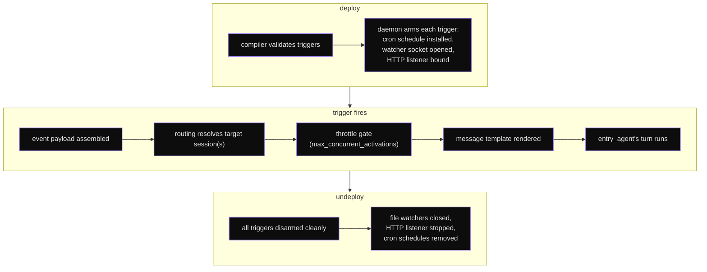

# Background Mode & Triggers

Background mode lets an app run autonomously - reacting to events
instead of waiting for user input. The app deploys, the daemon
arms its triggers, and an agent turn fires when one of them
activates.

This page documents the canonical `runtime.triggers[]` block. The
**other** family of triggers (inbound channels: webhooks, email,
slack, discord, telegram, RSS, ...) is declared under
`tools.channels` and covered in
[Channels (Bidirectional I/O)](40-channels.md).

## Execution modes

`runtime.mode`:

| Mode | Behavior |
|------|----------|
| `one_shot` | Process a single input via `runtime.input` / `runtime.output` and return. |
| `conversation` (default) | Interactive multi-turn chat loop. |
| `background` | Daemon-driven; activated by `runtime.triggers` and / or channel activations. |
| `pipeline` | Multi-app sequencing via `runtime.pipeline[]`. |

## Background skeleton

```yaml
runtime:
  mode: background
  max_turns: 30
  timeout: 120
  triggers:
    - id: <unique slug>
      type: cron | watch | http
      # type-specific fields below
      message: "Template for the agent (supports {{event.*}})"
      routing: broadcast | user | session
      routing_key: "{{event.header.X-User-Id}}"   # required for user/session
```

Deployed background apps **auto-start** their triggers. The daemon
arms each trigger at app activation and disarms it at undeploy.

## `TriggerConfig` reference

`TriggerConfig` (`extra: forbid`).

| Field | Type | Default | Description |
|-------|------|---------|-------------|
| `id` | string | *required* | Unique trigger identifier within the app. |
| `type` | string | *required* | One of `cron`, `watch`, `http`. |
| `schedule` | string | `""` | Cron expression. **`type=cron` only.** |
| `paths` | list[string] | `[]` | Glob patterns to watch. **`type=watch` only.** |
| `path` | string | `""` | HTTP endpoint path. **`type=http` only.** |
| `method` | `GET\|POST\|PUT\|DELETE\|PATCH\|HEAD\|OPTIONS` | `POST` | HTTP method. |
| `port` | int [1024, 65535] | `9100` | Listener port for the HTTP trigger. |
| `message` | string | `""` | Template sent to the agent when the trigger fires. Supports `{{event.*}}`. |
| `routing` | string | `"broadcast"` | How the activation routes to sessions: `broadcast`, `user`, or `session`. |
| `routing_key` | string | `""` | Template that extracts the routing identifier from the event payload. |

## The three canonical types

### `cron` - schedule-based

```yaml
runtime:
  mode: background
  triggers:
    - id: daily_morning
      type: cron
      schedule: "0 9 * * 1-5"        # weekdays at 9 a.m.
      message: |
        Morning summary check.
        Pull latest status and post the briefing.
```

5-field cron, standard syntax (`minute hour day month weekday`).
Common patterns:

| Expression | When |
|------------|------|
| `"0 9 * * *"` | Every day at 9 a.m. |
| `"0 9 * * 1-5"` | Weekdays at 9 a.m. |
| `"*/15 * * * *"` | Every 15 minutes. |
| `"0 0 1 * *"` | First of each month at midnight. |

The cron tick passes the trigger `message` to the agent **as-is** -
no `{{event.*}}` substitution happens for cron.
Compile-time variables like `{{sys.timestamp}}` resolve to the
**deploy time**, not the firing time, so don't rely on them for
"now" semantics; have the agent call the date/shell tool instead.
There's no inbound user message on a cron tick - see
[Session payloads](#session-payloads-for-scheduled-triggers).

### `watch` - filesystem watcher

```yaml
runtime:
  mode: background
  triggers:
    - id: new_csv
      type: watch
      paths:
        - "/var/data/inbox/*.csv"
        - "/var/data/uploads/**/*.json"
      message: |
        New file: {{event.path}}
        Process it and write a summary next to the source.
```

`paths` is a list of glob patterns; absolute paths are recommended.
Glob templates are NOT pre-resolved by the daemon - declare a
literal absolute path, or define `dev.variables.MY_DIR` in the YAML
and use `{{MY_DIR}}` (compile-time substitution).

Polling implementation: the daemon scans
each glob pattern every `watch_poll_interval` seconds (default
5, set via the daemon-level `~/.digitorn/config.yaml`, not the
app YAML) and fires the trigger for every file appearing in the
result set that wasn't there last tick.

**Substituted in the trigger `message` at fire time:**

| Token | Value |
|-------|-------|
| `{{event.path}}` | The new file path (the glob match string). |

That is the only token resolved for `watch` triggers. There is no
`event.kind` (creation-vs-modification is not distinguished by the
poller) and no `event.timestamp` - if the agent needs them it must
inspect the file via `filesystem.read` / `Bash`.

### `http` - webhook listener

```yaml
runtime:
  mode: background
  triggers:
    - id: github_push
      type: http
      path: /webhook/github
      method: POST
      port: 9100
      message: |
        GitHub event {{event.header.X-GitHub-Event}}
        on {{event.path}} via {{event.method}}.
        Raw body (truncated to 10 KB):

        {{event.body}}
```

The daemon binds an aiohttp listener on `port` (default `9100`,
range [1024, 65535]) and exposes `path`.
For richer webhook handling - JSON-path access (`event.body.foo.bar`),
HMAC verification, response shaping - use the **channels module**
webhook adapter instead ([Channels](40-channels.md)).

**Substituted in the trigger `message` at fire time** (literal
string replace, no JSON drilling):

| Token | Value |
|-------|-------|
| `{{event.body}}` | Raw request body as a string, capped at 10 000 chars. |
| `{{event.path}}` | The matched request path. |
| `{{event.method}}` | The matched HTTP method. |
| `{{event.header.X-GitHub-Event}}` | Whitelisted: GitHub event header. |
| `{{event.header.X-Gitlab-Event}}` | Whitelisted: GitLab event header. |
| `{{event.header.X-Webhook-Event}}` | Whitelisted: generic webhook event. |

Other headers, query params, and JSON body fields are NOT substituted
in the message template. If the agent needs them, pass `{{event.body}}`
and let the agent parse the JSON, or move to the channels webhook
adapter.

## Routing - who receives the activation

`routing` controls how the trigger fan-outs to
sessions:

| Value | Behaviour |
|-------|-----------|
| `broadcast` (default) | The activation fires for **every** active session of the app. Ignores `routing_key`. Throttled by `runtime.max_concurrent_activations`. |
| `user` | The activation fires for **every session of the user** identified by `routing_key`. Use when the event addresses a known person. |
| `session` | The activation fires for **one specific session** identified by `routing_key`. Use when the event references a chat/session id. |

`routing_key` is a template substituted at fire time
(). The substitution is literal-string
(not JSON-path), and the only tokens supported are:

| Token | Value |
|-------|-------|
| `{{event.body}}` | Raw body, truncated to 200 chars. Rarely useful for routing. |
| `{{event.path}}` | Request path. |
| `{{event.method}}` | Request method. |
| `{{event.header.X-User-Id}}` | Whitelisted user header. |
| `{{event.header.X-Session-Id}}` | Whitelisted session header. |
| `{{event.header.X-GitHub-Event}}` | Whitelisted GitHub header. |
| `{{event.query.<name>}}` | Any query-string parameter from the request URL. |

Common patterns:

```yaml
# Per-user webhook (caller sets X-User-Id header)
- id: support_inbox
  type: http
  path: /support
  method: POST
  routing: user
  routing_key: "{{event.header.X-User-Id}}"

# Per-session: chat id passed as a query parameter
- id: chat_event
  type: http
  path: /chat
  method: POST
  routing: session
  routing_key: "{{event.query.chat_id}}"
```

When `routing_key` resolves to an empty string, the activation is
dropped and a warning is logged - choose tokens that are guaranteed
to be present (or use the channels webhook adapter for proper JSON
routing).

## Throttling

`runtime.max_concurrent_activations` (, default
`20`, ≥ 1) caps how many activations of the same broadcast trigger
run in parallel. Prevents rate-limit storms when a broadcast trigger
fires across hundreds of active sessions.

```yaml
runtime:
  mode: background
  max_concurrent_activations: 5     # at most 5 sessions activate simultaneously
  triggers:
    - id: cron_5min
      type: cron
      schedule: "*/5 * * * *"
```

## Session payloads (for scheduled triggers)

Cron and watch triggers fire **without** an inbound user message -
the activation has no natural "what does the user want?" context.
Two strategies:

1. Hard-code the agent's task in the trigger `message` template
   (every tick gets the same instruction).
2. Use a **session payload** - each session pre-fills a prompt +
   metadata + files, the daemon replays it into every activation as
   if the user had typed it live.

```yaml
runtime:
  mode: background
  triggers:
    - id: hourly
      type: cron
      schedule: "0 * * * *"
  payload_schema:
    required: true
    prompt:
      required: true
      min_length: 20
    metadata:
      - { name: location, type: string, required: true }
    files:
      - name: cv
        required: true
        mime: [application/pdf]
        max_size_mb: 5
```

When `payload_schema.required: true`, the daemon refuses to fire on
incomplete sessions - the user must fill the form in the dashboard
first. Full reference: [Background Sessions](38-background-sessions.md).

## Multiple triggers

A single app can declare any number of triggers. They share the
same agent loop (one trigger fires → `runtime.entry_agent` runs a
turn), but their activations are independent.

```yaml
runtime:
  mode: background
  triggers:
    - id: hourly_summary
      type: cron
      schedule: "0 * * * *"
      message: "Hourly summary tick. Run the daily-status flow."

    - id: incoming_invoice
      type: watch
      paths: ["/var/data/invoices/*.pdf"]
      message: "New invoice: {{event.path}}"

    - id: github_webhook
      type: http
      path: /github
      method: POST
      message: |
        GitHub event {{event.header.X-GitHub-Event}}.
        Raw body:

        {{event.body}}
```

Templates are NOT shared across trigger types - each loop substitutes
its own narrow set (see the per-type tables above). To branch on the
trigger source, hard-code the routing into the message text itself
(e.g. start with "Hourly summary tick…" vs. "New invoice…"); the
agent reads the message and reacts to the wording. There is no
`{{trigger.id}}` token at fire time.

## Inbound channels (the other trigger family)

Apart from `runtime.triggers[]`, **channel providers with an
`activation:` block** also fire the agent. These live under
`tools.channels`:

```yaml
tools:
  channels:
    support_inbox:
      type: webhook
      config: { ... }
      activation:                    # turns this channel into a trigger
        prepare:
          - action: database.fetch_results
            params: { query: "..." }
            as: caller
        message: "{{caller.name}} writes: {{event.payload.message}}"
```

Inbound channels cover Telegram, Discord, Slack, email, webhook,
RSS, queue, voice, and any custom adapter the daemon ships. They
have a richer activation pipeline (`prepare:` steps, response
routing, etc.) than the three canonical
`runtime.triggers[]` types.

Full reference: [Channels (Bidirectional I/O)](40-channels.md).

## Compile-time validation

The compiler enforces the `TriggerConfig` schema at deploy:

- `type` must be one of `cron`, `watch`, `http`.
- `schedule` must be a valid 5-field cron expression when
  `type=cron`. Empty string raises an error for cron.
- `paths` must be non-empty when `type=watch`.
- `path` must be a valid HTTP path when `type=http`.
- `method` must be one of the seven supported verbs.
- `port` must be in [1024, 65535].
- Every `routing_key` template referenced fields are NOT validated
  at compile (resolution happens at fire time). Use `??` fallbacks
  for optional fields.

## Lifecycle



Background apps run continuously until explicitly undeployed:

```bash
# Deploy
install my-bg-app.yaml
install my-bg-app.yaml

# Inspect
install my-bg-app.yaml
digitorn dev status my-bg-app

# Tear down
uninstall my-bg-app
```

## Cross-references

- Block reference (every trigger field):
  [App Configuration → runtime.triggers](02-app-config.md#runtime---lifecycle-and-execution-policy)
- Channel-as-trigger (the OTHER family):
  [Channels (Bidirectional I/O)](40-channels.md)
- Session payloads + dashboard form:
  [Background Sessions](38-background-sessions.md)
- Throttling: `runtime.max_concurrent_activations`
  ([App Configuration](02-app-config.md))
- Routing pattern + multi-tenant:
  [Multi-Tenant Installs](45-multi-tenant.md)
