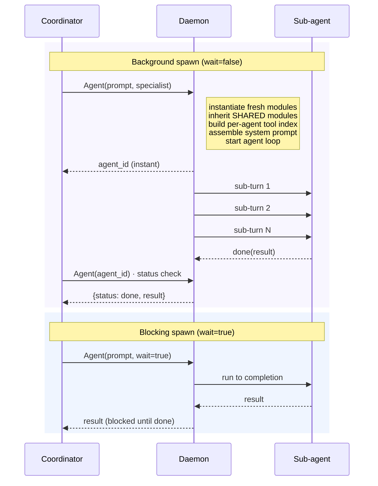

# Multi-Agent Systems

Multi-agent apps have a **coordinator** that spawns isolated
sub-agents. Each sub-agent has its own context window, runs an
independent agent loop, and returns its result back to the
coordinator. The whole spawn surface is a single LLM-callable tool -
`agent_spawn.agent` (alias `Agent`) - with eight modes dispatched
by params.

Every behaviour and field on this page maps to real code; entries
are cited with file + line.

## When to use multi-agent

- The work has **independent sub-tasks** that can run in parallel
  (search, analysis, audit across multiple files / domains).
- One sub-task needs a **fresh context window** (e.g. exploring a
  large codebase without polluting the coordinator's memory).
- A sub-agent should run with **different brain / tools / role**
  than the coordinator (cheap explorer + premium writer).

For deterministic graphs (triage → specialist → approval → output),
prefer the [`flow:` block](07-flows.md) - coordinator + spawn is
implicit orchestration; flow is explicit.

## YAML structure

```yaml
agents:
  - id: coordinator
    role: coordinator
    brain:
      provider: anthropic
      model: claude-sonnet-4-5
      backend: anthropic
      config:
        api_key: "claude-code"
    delegate_to: [explorer, writer, reviewer]
    pool:
      max_workers: 5
      progress: true
      auto_retry: 1
    system_prompt: |
      You orchestrate a team of specialists. Spawn them in parallel
      for independent tasks, sequentially when one needs the other's
      output.

  - id: explorer
    role: specialist
    specialty: "Read-only codebase exploration"
    modules:
      - { filesystem: [read, glob, grep] }
      - { memory: [remember] }
    brain:
      provider: deepseek
      model: deepseek-chat
      backend: openai_compat
      config:
        api_key: "{{secret.DEEPSEEK_API_KEY}}"

  - id: writer
    role: specialist
    specialty: "Apply code edits"
    modules:
      - filesystem
      - { shell: [bash] }
    brain:
      provider: deepseek
      model: deepseek-chat
      backend: openai_compat
      config:
        api_key: "{{secret.DEEPSEEK_API_KEY}}"
    plan_first: false

  - id: reviewer
    role: specialist
    specialty: "Adversarial code review"
    instructions:
      file: ./instructions/review.md
      capabilities: [git_review]
    brain:
      provider: anthropic
      model: claude-haiku-4-5
      backend: anthropic
      config:
        api_key: "claude-code"

tools:
  modules:
    filesystem: {}
    shell: {}
    memory: {}
  capabilities:
    grant:
      - { module: agent_spawn }       # coordinator can call Agent()
```

Every module referenced under `agents[].modules` must also appear
under `tools.modules` (the compiler enforces this - see
[Compile-time validation](#compile-time-validation) below).

`runtime.entry_agent` controls which agent
starts each turn. The default is the first agent declared. Sub-
agents are reachable from the coordinator via `Agent(...)` calls.

## The single `Agent` tool, eight modes

`agent` tool. One action, eight
modes dispatched by params (
`AgentParams`).

| Mode | Trigger params | Behaviour |
|------|---------------|-----------|
| 1. Spawn (background, default) | `prompt` (and optional `specialist`) | Returns `agent_id` immediately. Sub-agent runs in background. |
| 2. Spawn (blocking) | `prompt` + `wait=true` | Blocks until done; returns the sub-agent's result. |
| 3. Status check | `agent_id` | Current state (`running`/`done`/`failed`/`cancelled`). |
| 4. Wait for one | `agent_id` + `wait=true` (+ `timeout`) | Block until that agent finishes. |
| 5. Collect many | `agent_ids: [a, b, ...]` | Block until each finishes; return all results. Omit `agent_ids` to wait for everything. |
| 6. Cancel | `agent_id` + `cancel=true` | Force-cancel a running spawn. |
| 7. Reassign | `agent_id` + `reassign: <new prompt>` | Cancel + respawn the same id with a new task. |
| 8. List | `list_agents=true` | All current spawns and their status. |

All eight modes route through the same `Agent()` tool; the
mode is picked from the param set.

### `AgentParams`

Visible to the LLM unless marked
hidden.

| Field | Type | Default | Description |
|-------|------|---------|-------------|
| `prompt` | string \| null | `null` | Task description. Required for spawn modes. |
| `specialist` | string \| null | `null` | Pick a declared specialist by id. Auto-routes when omitted. |
| `system_prompt` | string \| null | `null` | Override the specialist's system prompt for this single spawn. |
| `agent_id` | string \| null | `null` | Single agent target (status / wait / cancel / reassign). |
| `agent_ids` | list[string] \| null | `null` | Collect mode - wait for each. `null` = wait for ALL active spawns. |
| `wait` | bool | `false` | Block the parent turn. Default `false` - most spawns run in background. |
| `cancel` | bool | `false` | With `agent_id`, force-cancel. |
| `reassign` | string \| null | `null` | With `agent_id`, cancel and respawn with this new prompt. |
| `list_agents` | bool | `false` | List all spawns. |
| `timeout` | float | (varies, see code) | Max seconds to block in wait modes. |

### Examples

```json
// Mode 1: Background spawn - returns agent_id instantly
{"name": "Agent", "arguments": {
  "specialist": "explorer",
  "prompt": "Search src/auth/ for any reference to deprecated token validation."
}}

// Mode 2: Blocking spawn - block parent turn
{"name": "Agent", "arguments": {
  "specialist": "writer",
  "prompt": "Apply the rename: foo() → handle_foo() in src/handlers/foo.ts.",
  "wait": true
}}

// Mode 5: Collect three concurrent spawns
{"name": "Agent", "arguments": {
  "agent_ids": ["agent_abc", "agent_def", "agent_ghi"]
}}

// Mode 5 (variant): Wait for ALL active spawns
{"name": "Agent", "arguments": {"agent_ids": null}}

// Mode 7: Reassign - cancel + respawn with new prompt
{"name": "Agent", "arguments": {
  "agent_id": "agent_abc",
  "reassign": "Try a different approach: search by regex /auth.*token/ instead."
}}
```

## Coordinator pool

`AgentPoolConfig`. Caps fan-out and controls
auto-retry.

```yaml
agents:
  - id: coordinator
    role: coordinator
    pool:
      max_workers: 5     # int [1, 100], default 3
      progress: true     # default false - relay specialist progress events
      auto_retry: 1      # int [0, 5], default 0
```

| Field | Type | Default | Effect |
|-------|------|---------|--------|
| `max_workers` | int [1, 100] | `3` | Maximum concurrent sub-agents this coordinator can have running. |
| `progress` | bool | `false` | Relay specialist progress events back to the coordinator (file edits, tool calls, status). |
| `auto_retry` | int [0, 5] | `0` | Automatic retries when a specialist fails. |

When fan-out exceeds `max_workers`, additional `Agent(...)` calls
queue and start as slots free up.

## Module sharing - what sub-agents inherit


`_SHARE_MODULES = {"memory", "web", "lsp", "filesystem", "shell"}`.
**These five modules are SHARED** between the coordinator and every
sub-agent it spawns - same instance, same workspace, same memory
store, same `read_files` set, same shell session table.

| Module | Why it's shared |
|--------|-----------------|
| `memory` | Sub-agents see the coordinator's facts and todos. Writes from any of them flow back. |
| `web` | Shared HTTP cache, shared rate-limit window. |
| `lsp` | Shared diagnostics state - a sub-agent's `LintFile` sees the coordinator's edits. |
| `filesystem` | Shared workspace + shared `_read_files` (so `Edit` after a sub-agent's `Read` works). |
| `shell` | Shared background-task table; `task_status(task_id)` in the coordinator sees a task launched by a sub-agent. |

**Every other module** (database, http, channels, mcp, agent_spawn,
behavior, ...) gets a **fresh per-spawn instance**. The sub-agent's
database connection isn't the coordinator's; the sub-agent can't
see the coordinator's MCP server pool; the sub-agent's behaviour
state starts empty.

This is the most surprising piece of Digitorn semantics: a
sub-agent calling `filesystem.read` sees the same files the
coordinator just wrote, even though they're "different agents".

## Per-agent module restriction

`AgentDefinition.modules`. Each specialist can
declare **which modules / actions** it has access to (full ref:
[Agents → Per-agent module access](03-agents.md#per-agent-module-access)).

```yaml
agents:
  - id: explorer
    modules:
      - { filesystem: [read, glob, grep] }   # only these 3 actions
      - { memory: [remember] }                # single action

  - id: writer
    modules:
      - filesystem                            # full module access
      - { shell: [bash] }                     # only bash

  - id: reviewer
    modules:
      - { memory: [remember] }                # reviewer has no edit tools
```

Empty `modules: []` means the specialist inherits the coordinator's
module set (the default).

The compiler builds a per-agent action filter from this list and
hands it to the context builder, so the LLM never sees actions it
isn't allowed to call.

## Spawn lifecycle



`agent_spawn` cleans up on session end
(`cleanup_session`) - every
running spawn is cancelled, `agent_cancel` events emitted, and
the per-spawn module instances released.

## Coordination patterns

### Parallel spawn (same turn)

Multiple `Agent(...)` calls in the SAME LLM turn run concurrently.
The default `wait=false` returns immediately with each `agent_id`,
so the coordinator can issue all spawns first, then wait once for
all of them.

```json
// All three lines emit in the same turn - they all run concurrently
{"name": "Agent", "arguments": {"specialist": "explorer", "prompt": "Search auth code..."}}
{"name": "Agent", "arguments": {"specialist": "explorer", "prompt": "Search database code..."}}
{"name": "Agent", "arguments": {"specialist": "explorer", "prompt": "Search API routes..."}}
```

Then in a later turn, collect:

```json
{"name": "Agent", "arguments": {"agent_ids": ["agent_a", "agent_b", "agent_c"]}}
```

### Sequential delegation

Use `wait=true` when the next step depends on the previous result:

```json
// Step 1: explorer finds the bug - block until done
{"name": "Agent", "arguments": {
  "specialist": "explorer",
  "prompt": "Find the function that raises ValueError on empty input.",
  "wait": true
}}

// Step 2 (next turn): writer applies the fix using the explorer's findings
{"name": "Agent", "arguments": {
  "specialist": "writer",
  "prompt": "Fix parse_config in src/config.ts:42 by handling the empty-dict case.",
  "wait": true
}}
```

### Background + collect (long-running)

For tasks that take minutes:

```json
// Turn 1: launch, get agent_ids, continue with other work
{"name": "Agent", "arguments": {"specialist": "auditor", "prompt": "Run the full test suite and triage every failure."}}

// Turns 2..N: do other things; coordinator gets auto-notification when each spawn completes:
//   [AGENT COMPLETED] agent_id=agent_xyz specialist=auditor elapsed=180s
//   [AGENT COMPLETED] agent_id=agent_def specialist=auditor elapsed=240s

// Turn N+1: collect results
{"name": "Agent", "arguments": {"agent_ids": null}}     // null = all active spawns
```

## Auto-retry

`pool.auto_retry: N` (1-5) makes failed spawns retry up to N times
automatically before surfacing the failure to the coordinator. The
retry uses the same prompt and specialist; transient failures (rate
limits, network blips, single-turn timeouts) recover invisibly.

```yaml
agents:
  - id: coordinator
    role: coordinator
    pool:
      max_workers: 5
      auto_retry: 2          # transient failures recover automatically
```

## Auto-notification on completion

The coordinator gets a system message in the next turn when a
background spawn completes:

```
[AGENT COMPLETED] agent_id=agent_xyz specialist=explorer elapsed=12.3s
```

The coordinator does **not** need to poll. Status checks are
optional - they're useful when the coordinator has time-sensitive
work that depends on a specific spawn finishing.

## Compile-time validation

The compiler enforces:

- Every `delegate_to` entry references a declared agent.
- Every `specialist` parameter at compile time references a real
  declared agent (the runtime check at spawn time has the same
  effect).
- `modules:` granular entries follow the
  `{module_id: [action_names]}` shape (
  `_validate_modules_shape`).
- `pool.max_workers` ∈ [1, 100], `pool.auto_retry` ∈ [0, 5].

## Cross-references

- Agent definition reference (every field): [Agents](03-agents.md)
- Coordinator pool field reference:
  [Agents → Coordinator pool](03-agents.md#coordinator-pool)
- Per-agent module restriction:
  [Agents → Per-agent module access](03-agents.md#per-agent-module-access)
- Single-action multi-mode pattern (also used by
  `background_run`, `schedule`):
  [Execution Primitives](04c-primitives.md)
- Built-in tools index (`Agent` alias):
  [Built-in Tools](04b-builtin-tools.md#agent-spawn-tool-gated-by-agent_spawn-module-loaded)
- Per-module reference: [modules/reference/agent_spawn.md](../reference/modules/agent_spawn.md)
