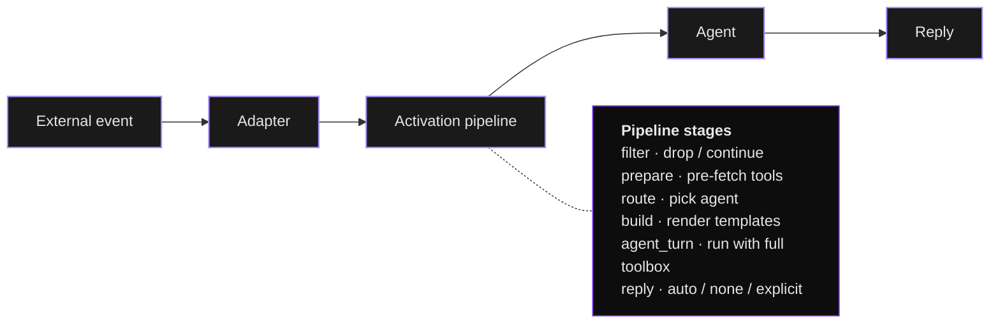

# Channels Module

The `channels` module is Digitorn's **bidirectional I/O system**.
It receives events from external sources (cron, webhooks, email,
file changes, RSS, message queues, voice calls, chat platforms)
and sends responses through the same or a different channel -
all configured in YAML, no code required.

Every claim on this page maps to real code in Entries are cited with
file + line.

## Architecture in one diagram



## Why one module instead of `runtime.triggers`?

`runtime.triggers` is the legacy lightweight
trigger system - only `cron` / `watch` / `http`, only inbound,
no enrichment pipeline. The `channels` module supersedes it
with:

- **11 adapter types** (vs. 3): full bidirectional matrix.
- **Activation pipeline** with `filter` / `prepare` / `route` /
  `session` / `reply`.
- **Per-provider concurrency cap** + per-session lock.
- **Bidirectional templates** with runtime + compile-time scopes.
- **Reply context** (email `In-Reply-To`, Slack `thread_ts`,
  Telegram `reply_to_message_id`, ...) used by `reply: auto`.

When `tools.modules.channels` is loaded, the legacy trigger
loops are bypassed
().

## Installation

`channels` is built-in Add it to `tools.modules:`:

```yaml
tools:
  modules:
    channels:
      config:
        providers: {}            # required wrapper, even if empty initially
```

### Optional dependencies

Per-adapter optional installs:

| Adapter | Direction | Optional dep |
|---------|-----------|--------------|
| `cron` | Inbound | None (uses `croniter` if available, else minute scan). |
| `file_watcher` | Inbound | None. |
| `webhook` | Both | `aiohttp` (outbound delivery). |
| `email` | Both | None (stdlib `imaplib` / `smtplib`). |
| `telegram` | Both | `aiohttp`. |
| `discord` | Both | `aiohttp`. |
| `slack` | Both | `aiohttp`. |
| `voice` | Both | `aiohttp` (+ `edge-tts` for Edge TTS). |
| `rss` | Inbound | `feedparser`. |
| `log` | Outbound | None. |
| `queue` | Both | None. |

The full registry lives at
(`_BUILTIN_ADAPTERS`). Lazy
imports - adding the missing pip dep enables the adapter at
restart.

## Quick start

### Cron only (no reply)

```yaml
runtime:
  mode: background

tools:
  modules:
    channels:
      config:
        providers:
          morning_check:
            adapter: cron
            config:
              schedule: "0 9 * * 1-5"
            activation:
              message: "Run the daily status check."
```

### Bidirectional - webhook in + Slack out

```yaml
tools:
  modules:
    channels:
      config:
        providers:
          github:
            adapter: webhook
            config:
              inbound_path: /hook/github
              auth: signature
              signature_secret: "{{secret.GITHUB_WEBHOOK_SECRET}}"
              signature_header: X-Hub-Signature-256
            activation:
              message: "GitHub: {{event.payload.action}} on {{event.payload.repository.full_name}}"

          slack_alert:
            adapter: webhook
            config:
              url: "{{secret.SLACK_WEBHOOK_URL}}"
```

The agent receives GitHub events and can notify Slack:

```
channels.send_message(provider="slack_alert", text="PR #42 merged!")
```

## Core concepts

### Provider

A named adapter instance.
`ProviderConfig`:

| Field | Source | Description |
|-------|--------|-------------|
| `adapter` | | Adapter type name (must be in the registry). |
| `config` | | Adapter-specific dict (URLs, credentials, schedules, paths). |
| `activation` | | `ActivationConfig` - see below. |
| `enabled` | | Toggle without removing. |
| `max_concurrent` | | `[1, 100]`, default `5`. Per-provider semaphore. |

### Activation pipeline

`ActivationConfig`:

| Field | Default | Purpose |
|-------|---------|---------|
| `agent` | `""` | Target agent id (empty → `default_agent`). |
| `session` | `"per_event"` | `per_event` / `shared` / template string. |
| `message` | `""` | User message template with `{{event.*}}`, `{{<as>.*}}`, etc. |
| `context` | `""` | Extra system-prompt context template. |
| `expose_data` | `false` | Surface raw event data to the agent context (in addition to the rendered `message` / `context` templates). |
| `filter` | `[]` | List of `FilterCondition` - drop on first miss. |
| `prepare` | `[]` | List of `PrepareStep` - pre-activation tool calls. |
| `route` | `null` | `RouteConfig` - dynamic agent picker. |
| `reply` | `"none"` | `auto` / `none` / `explicit`. |

### Module-level config

`ChannelsConfig`:

| Field | Default | Bounds |
|-------|---------|--------|
| `providers` | `{}` | dict[name, ProviderConfig] |
| `default_agent` | `""` | Used when `activation.agent` is empty. |
| `max_turns` | `30` | `[1, 200]` per activation. |
| `timeout` | `120.0` s | `[5.0, 3600.0]` per activation. |
| `history_limit` | `200` | `[0, 10000]` event records kept. |
| `secret_filter_enabled` | `true` | Mask secret patterns in outbound text. |

```yaml
tools:
  modules:
    channels:
      config:
        providers: { ... }
        default_agent: receptionist
        max_turns: 30
        timeout: 120
        history_limit: 200
        secret_filter_enabled: true
```

## Template variables

 Single-pass regex substitution - no
eval, no Jinja2.

### Compile-time scopes

| Variable | Source | Example |
|----------|--------|---------|
| `{{credential.PROVIDER.FIELD}}` *(preferred)* | Credentials vault | `{{credential.slack_alerts.webhook_url}}` |
| `{{secret.X}}` (legacy) | Encrypted secret store | `{{secret.WEBHOOK_SECRET}}` |
| `{{env.VAR}}` | Daemon env (whitelist enforced) | `{{env.SUPPORT_EMAIL}}` |
| `{{sys.hostname / date / timestamp / platform / user}}` | System info | `{{sys.date}}` |
| `{{app.id / name / version}}` | App YAML | `{{app.name}}` |

### Runtime scopes

Resolved when an event arrives, in
`activation.message` / `activation.context` /
`activation.prepare[].params`:

| Variable |
|----------|
| `{{event.source}}` |
| `{{event.payload.<path>}}` |
| `{{event.data.<path>}}` |
| `{{event.provider}}` |
| `{{event.adapter}}` |
| `{{event.message}}` |
| `` |
| `{{items.0.title}}` |

### Mixing both

```yaml
activation:
  context: |
    App: {{app.name}} v{{app.version}} on {{sys.hostname}}
    Client: {{caller.name}} ({{caller.plan}})
    Channel: {{event.adapter}} from {{event.source}}
  message: "{{event.payload.message}}"
```

Compile-time tokens (`{{app.name}}`, `{{sys.hostname}}`) are
substituted once when the YAML loads. Runtime tokens
(`{{event.*}}`, `{{caller.*}}`) are substituted per activation.

### Template safety

| Guard | Source | Behaviour |
|-------|--------|-----------|
| No eval / exec / Jinja2 | | Single-pass regex substitution. |
| `{{secret.*}}` / `{{env.*}}` blocked at runtime | | Resolved at compile time only - runtime attempts logged as warnings. |
| Single-pass substitution | | `{{{{nested}}}}` → `{{nested}}`, never recursed. Blocks template-injection attacks. |
| 256 KB output cap | | Prevents expansion bombs from large variables. |

## Session strategies

Controls how conversation history is keyed across activations
():

| `session` | Behaviour | Use case |
|-----------|-----------|----------|
| `per_event` (default) | Fresh session each time. | Webhooks, cron - no memory needed. |
| `shared` | Persistent session per `(provider, source)`. | WhatsApp, SMS, chat - one conversation per contact. |
| `<template>` | Custom key. | `wa-{{event.source}}` per phone, `ticket-{{event.payload.id}}` per ticket. |

Shared sessions hold an `asyncio.Lock` per session key - concurrent
events for the same key serialise so the agent never sees two
overlapping turns on the same conversation
().

```yaml
activation:
  session: "wa-{{event.source}}"   # one session per phone number
  reply: auto
```

## Filter conditions

`FilterCondition`. Drop events on first miss
(AND logic across the list).

```yaml
activation:
  filter:
    - { field: event.payload.status,   equals: new }
    - { field: event.payload.type,     not_equals: spam }
    - { field: event.payload.title,    contains: URGENT }
    - { field: event.payload.amount,   gt: 100 }
    - { field: event.payload.priority, lt: 3 }
```

Operators: `equals`, `not_equals`, `contains`, `gt`, `lt`. Field
is a dotted path into the event dict.

## Prepare steps

`PrepareStep`. Call any module action via the
ServiceBus **before** the agent starts; results are bound under
`as_field` for downstream templates.

```yaml
activation:
  prepare:
    - action: database.fetch_results
      params:
        connection_id: main
        query: "SELECT * FROM clients WHERE phone = :p0"
        params: ["{{event.source}}"]
      as: caller

    - action: rag.query
      params:
        knowledge_base: procedures
        query: "procedure for {{event.payload.category}}"
      as: procedure

    - action: database.fetch_results
      params:
        connection_id: main
        query: |
          SELECT id, title, status FROM tickets
          WHERE client_id = :p0
          ORDER BY created_at DESC LIMIT 5
        params: ["{{caller.rows.0.id}}"]
      as: recent_tickets
```

Steps execute sequentially; each can reference results of
earlier steps. The result stored under `as:` is the action's
`data` field, so `database.fetch_results` results are accessed
as `{{caller.rows.0.id}}` (rows is a list of row dicts), `rag.query`
results as `{{procedure.results.0.text}}`, etc. Always pass user-
controlled values through bind parameters (`:p0`, `:p1`, ...)
instead of interpolating them into the query string, otherwise a
crafted `event.source` is a SQL injection.

> **Same security gates apply.** Prepare steps go through the
> ServiceBus - every permission, rate limit, and audit
> applies just as if the agent had called the tool itself.

## Dynamic routing

`RouteConfig` - pick the agent based on a
field value. First match wins; falls back to `default_agent` if
no rule matches and no `default: true` is set.

```yaml
activation:
  route:
    field: caller.department
    rules:
      - { match: tech,    agent: tech_support }
      - { match: billing, agent: billing_agent }
      - { match: sales,   agent: sales_agent }
      - { default: true,  agent: general_support }
```

## Reply mode

| `reply` | Behaviour |
|---------|-----------|
| `auto` | Agent's final response auto-sent on the originating channel using `reply_context`. |
| `none` (default) | Response stays in-session; agent must call `channels.send_message` / `channels.reply` explicitly. |
| `explicit` | Same as `none`. |

`reply: auto` is the right default for conversational channels
(WhatsApp, email, Telegram, Discord, Slack). The agent just
responds; the daemon delivers.

## The 11 built-in adapters

### `cron` - schedule trigger (inbound)

 Standard 5-field cron expression.

```yaml
providers:
  daily_report:
    adapter: cron
    config:
      schedule: "0 9 * * 1-5"           # 9am Mon–Fri
      message: "Generate the daily report."
    activation:
      agent: reporter
```

| Config | Default | Notes |
|--------|---------|-------|
| `schedule` | required | 5-field cron expression. |
| `message` | `""` | Template (event has no payload). |

Uses `croniter` if installed for precise scheduling; falls back
to a minute-step scan otherwise.

### `file_watcher` - glob polling (inbound)

 Polls glob patterns for new files.
Existing files at startup are ignored (only new files trigger).

```yaml
providers:
  csv_inbox:
    adapter: file_watcher
    config:
      paths: ["./inbox/*.csv", "./uploads/*.xlsx"]
      poll_interval: 5.0
      message: "New file: {{event.payload.filename}}"
    activation:
      agent: data_processor
```

Event payload:

```json
{
  "path": "./inbox/report.csv",
  "resolved_path": "/abs/path/report.csv",
  "filename": "report.csv",
  "size": 1024,
  "modified": 1711540800.0
}
```

In-memory deduplication seen-set capped at 10 000 entries.

### `webhook` - bidirectional HTTP

 Inbound POST listener + outbound POST
delivery.

> **Inbound routing status.** Outbound (`url`, `headers`,
> `channels.send_message`) works end-to-end. Inbound HMAC and
> sanitisation logic is implemented in the adapter, but the
> daemon does not yet expose the configured `inbound_path` as a
> real HTTP route. Until that wiring lands, exercise inbound
> handling with `channels.simulate_event` from the agent, or use
> the legacy `runtime.triggers.http` (separate port,
> path `/trigger/<id>`) when you need a real public endpoint.

```yaml
providers:
  # Inbound only
  github:
    adapter: webhook
    config:
      inbound_path: /hook/github
      auth: signature
      signature_secret: "{{secret.GITHUB_WEBHOOK_SECRET}}"
      signature_header: X-Hub-Signature-256
    activation:
      message: "GitHub: {{event.payload.action}}"

  # Outbound only (Slack notification)
  slack_alerts:
    adapter: webhook
    config:
      url: "{{secret.SLACK_WEBHOOK_URL}}"
      headers: { Content-Type: "application/json" }

  # Bidirectional
  whatsapp:
    adapter: webhook
    config:
      inbound_path: /hook/whatsapp
      auth: signature
      signature_secret: "{{secret.WA_SECRET}}"
      url: "{{secret.WA_API_URL}}"
      headers:
        Authorization: "Bearer {{secret.WA_TOKEN}}"
    activation:
      session: "wa-{{event.source}}"
      reply: auto
```

| Config | Default | Notes |
|--------|---------|-------|
| `inbound_path` | `""` | URL path to listen on. Empty = no inbound. |
| `auth` | `"none"` | `none` / `signature` / `api_key`. |
| `signature_secret` | `""` | HMAC shared secret. |
| `signature_header` | `"X-Signature-256"` | Header carrying the HMAC. |
| `api_key` | `""` | Expected `X-API-Key` value. |
| `max_payload_bytes` | `1_048_576` | 1 MB. |
| `url` | `""` | Outbound POST target. Empty = no outbound. |
| `headers` | `{}` | Custom headers on outbound. |
| `timeout` | `10.0` | Outbound HTTP timeout (s). |

#### Authentication

- **HMAC** (`auth: signature`) - SHA-256 with constant-time
  compare (`hmac.compare_digest`). Accepts raw hex AND prefixed
  (`sha256=...`).
- **API key** (`auth: api_key`) - constant-time compare against
  the `X-API-Key` header.
- **None** (`auth: none`) - no verification. Use only behind a
  proxy that handles auth.

#### Inbound security

| # | Guard |
|---|-------|
| 1 | Payload size enforced **before** JSON parsing. |
| 2 | Content-Type whitelist: `application/json`, `application/x-www-form-urlencoded`, `text/plain` (else 415). |
| 3 | Payload sanitisation strips prototype-pollution keys (`__proto__`, `__class__`, `constructor`, `__*`, `$$*`). Limits: depth 10, string 10 000, dict 200 keys, list 500 items. |
| 4 | Sensitive header stripping from `event.metadata.headers`: `Authorization`, `Cookie`, `X-API-Key`, `X-Signature-256`, `X-Hub-Signature-256`. |

### `email` - IMAP + SMTP (bidirectional)

 stdlib only.

```yaml
providers:
  support_email:
    adapter: email
    config:
      imap:
        host: imap.gmail.com
        port: 993
        user: "{{env.SUPPORT_EMAIL}}"
        password: "{{secret.EMAIL_APP_PASSWORD}}"
        folder: INBOX
      smtp:
        host: smtp.gmail.com
        port: 587
        user: "{{env.SUPPORT_EMAIL}}"
        password: "{{secret.EMAIL_APP_PASSWORD}}"
      poll_interval: 30
      from_address: support@company.com
    activation:
      session: "email-{{event.source}}"
      reply: auto
```

Inbound payload:

```jsonc
{
  "uid": "123",
  "from": "client@example.com",
  "to": "support@company.com",
  "subject": "Help with my account",
  "body": "Hello, I need assistance with...",
  "date": "Thu, 27 Mar 2026 10:30:00 +0100",
  "message_id": "<abc123@mail.example.com>"
}
```

`reply: auto` sends a reply with proper `In-Reply-To` and
`References` headers for threading.

> **Gmail**: use an [App Password](https://myaccount.google.com/apppasswords),
> not your account password. Enable IMAP in Gmail settings.

### `telegram` - Bot API (bidirectional)

 Long polling inbound, REST outbound.

```yaml
providers:
  bot:
    adapter: telegram
    config:
      token: "{{secret.TELEGRAM_BOT_TOKEN}}"
      poll_timeout: 30
      # allowed_chat_ids: [123456789]
    activation:
      message: "{{event.payload.text}}"
      context: "Telegram user: {{event.payload.display_name}} (chat {{event.payload.chat_id}})"
      reply: auto
      session: "tg-{{event.payload.chat_id}}"
```

Setup: talk to [@BotFather](https://t.me/BotFather), `/newbot`,
copy the token. Messages from bots (including itself) are
auto-ignored. Replies use Markdown with auto-fallback to plain
on parse error.

### `discord` - WebSocket Gateway (bidirectional)

 Real-time WS Gateway inbound, REST
outbound. No polling delay.

```yaml
providers:
  bot:
    adapter: discord
    config:
      token: "{{secret.DISCORD_BOT_TOKEN}}"
      # allowed_channel_ids: ["123456"]
      # allowed_guild_ids:   ["789012"]
    activation:
      message: "{{event.payload.text}}"
      context: "Discord user: {{event.payload.display_name}} in channel {{event.payload.channel_id}}"
      reply: auto
      session: "discord-{{event.payload.channel_id}}"
```

Setup: [discord.com/developers/applications](https://discord.com/developers/applications)
→ Bot tab (reset token, enable Message Content intent) → OAuth2
URL Generator (scope `bot`, perms: Send Messages, Read History,
View Channels) → invite. Bots auto-ignored.

### `slack` - Socket Mode (bidirectional)

 WSS Socket Mode inbound (no public URL
needed), Web API outbound. Replies posted as **thread replies**
to the original message.

```yaml
providers:
  bot:
    adapter: slack
    config:
      bot_token: "{{secret.SLACK_BOT_TOKEN}}"   # xoxb-...
      app_token: "{{secret.SLACK_APP_TOKEN}}"   # xapp-...
      # allowed_channel_ids: ["C0123456789"]
    activation:
      message: "{{event.payload.text}}"
      context: "Slack user: {{event.payload.user_id}} in channel {{event.payload.channel_id}}"
      reply: auto
      session: "slack-{{event.payload.channel_id}}"
```

Setup: [api.slack.com/apps](https://api.slack.com/apps) → enable
Socket Mode (generate `xapp-...`) → Event Subscriptions
(`message.channels`, `message.im`) → OAuth & Permissions scopes
(`chat:write`, `channels:history`, `channels:read`,
`im:history`, `im:read`) → install (`xoxb-...`) → invite the
bot to a channel.

### `voice` - phone / browser calls (bidirectional)

`adapters/voice/`. Composable: pick a backend + TTS + STT
provider independently in YAML.

```yaml
providers:
  phone:
    adapter: voice
    config:
      backend: websocket               # twilio_cr | websocket
      language: fr
      welcome: "Bonjour, comment puis-je vous aider ?"
      backend_config:
        port: 8766
        tts:
          provider: edge               # edge | elevenlabs | openai | http | browser
          voice: fr-FR-DeniseNeural
        stt:
          provider: browser            # browser | deepgram | openai | http
    activation:
      message: "{{event.payload.transcript}}"
      context: "Voice call from {{event.payload.caller}} ({{event.payload.direction}})"
      reply: auto
      session: "call-{{event.payload.call_id}}"
```

Backends:

| Backend | Transport | Phone | Browser | Self-host |
|---------|-----------|:-----:|:-------:|:---------:|
| `twilio_cr` | Twilio ConversationRelay | yes | no | no |
| `websocket` | Generic WSS (JSON + binary) | no | yes | yes |

TTS providers: `edge` (free, neural, ~100 ms), `elevenlabs`
(premium, ~75 ms), `openai` (~200 ms), `http` (any
self-hosted Coqui XTTS / Piper / MaryTTS), `browser` (Web
Speech API, instant, robotic).

STT providers: `deepgram` (~150 ms), `openai` Whisper (~500 ms),
`http` (faster-whisper, Vosk, Kaldi, ...), `browser` (Web
Speech, instant).

```yaml
# Edge TTS
tts:
  provider: edge
  voice: fr-FR-DeniseNeural
  rate: "+5%"

# ElevenLabs
tts:
  provider: elevenlabs
  api_key: "{{secret.ELEVENLABS_API_KEY}}"
  voice_id: "21m00Tcm4TlvDq8ikWAM"
  model: eleven_flash_v2_5

# Self-hosted (Coqui XTTS, Piper, ...)
tts:
  provider: http
  url: "http://localhost:5002(daemon API)"
  voice: my_custom_voice

# Deepgram STT
stt:
  provider: deepgram
  api_key: "{{secret.DEEPGRAM_API_KEY}}"
  model: nova-3

# Self-hosted faster-whisper
stt:
  provider: http
  url: "http://localhost:9000/asr"
```

Inbound payload (all backends):

```json
{
  "call_id": "call-6f91d2ab24d5",
  "transcript": "Bonjour, comment ca va ?",
  "caller": "+33612345678",
  "direction": "inbound",
  "language": "fr"
}
```

For Twilio: configure the phone number's Voice webhook to point
at the daemon's TwiML endpoint exposed by the backend.

### `rss` - feed polling (inbound)

 Requires `feedparser`.

```yaml
providers:
  hn:
    adapter: rss
    config:
      feed_url: "https://hnrss.org/newest"
      poll_interval: 600
      max_entries_per_poll: 10
    activation:
      filter:
        - { field: event.payload.title, contains: AI }
      agent: researcher
      message: "New article: {{event.payload.title}}\n{{event.payload.link}}"
```

Existing entries skipped on first poll (only new entries fire).
Deduplication by entry id / link.

### `log` - Python logging (outbound only)

 Useful for debugging, audit, dev.

```yaml
providers:
  audit:
    adapter: log
    config:
      level: info                       # debug | info | warning | error
      logger: digitorn.channels.output
```

### `queue` - inter-app bus (bidirectional)

 Bridges to the `queue` module via
the ServiceBus.

```yaml
providers:
  order_events:
    adapter: queue
    config:
      queue: orders
      topics: ["order.created", "order.updated"]
      poll_interval: 5.0
    activation:
      session: "order-{{event.payload.order_id}}"
      message: "New order event: {{event.payload.type}}"
```

Requires the `queue` module to be loaded.

## The 11 agent-side actions

 All exposed via the standard tool surface.

| Tool | Source | Risk | Purpose |
|------|--------|:----:|---------|
| `channels.send_message` | | medium | Send to a specific provider (any direction-supporting adapter). |
| `channels.reply` | | medium | Reply on the channel that triggered this activation (uses `reply_context`). |
| `channels.broadcast` | | high | Send the same message to multiple providers in one call. |
| `channels.list_providers` | | low | Configured + available adapter catalog. |
| `channels.provider_status` | | low | Status / capabilities of one provider. |
| `channels.pause_provider` | | medium | Pause inbound listener. |
| `channels.resume_provider` | | medium | Resume a paused listener. |
| `channels.provider_history` | | low | Recent inbound + outbound event history (filtered by provider / direction). |
| `channels.stats` | | low | Aggregate counts (received / sent / active sessions / history size). |
| `channels.simulate_event` | | medium | Drop a synthetic inbound event into a provider - for testing. |
| `channels.test_send` | | medium | Outbound smoke test; delegates to `send_message`. |

```python
# send_message - any provider
channels.send_message(
    provider="slack_alerts",
    text="Server CPU at 95%!",
    subject="Alert",
    recipient="#ops-channel",
)

# reply - only valid during an inbound activation
channels.reply(text="Thanks for contacting support. Looking into it.")

# broadcast - fan-out
channels.broadcast(
    providers=["slack_alerts", "email_team", "audit"],
    text="Critical: database connection lost",
    subject="Database Alert",
)
```

Aliases (French + alternates) shipped per action: `envoyer_message`,
`repondre`, `diffuser`, `lister_canaux`, etc.

## Outbound security

| # | Guard |
|---|-------|
| 1 | **SSRF blocklist** on outbound URLs |
| 2 | **Secret filtering** (`secret_filter_enabled: true`, default) |
| 3 | **Header masking in logs** |

## Isolation

| # | Guard |
|---|-------|
| 1 | Each adapter receives a shallow copy of its config dict - no cross-adapter state. |
| 2 | Credentials resolved at compile time and passed as plain config values - adapters never touch the credential store. |
| 3 | Per-provider semaphore caps concurrent activations (`max_concurrent`, default 5). Shared sessions add an `asyncio.Lock` per session key. |

## Capabilities

The `capabilities:` block gates what the agent can call:

```yaml
tools:
  capabilities:
    grant:
      - {module: channels, actions: [list_providers, provider_history, stats, reply]}
    approve:
      - {module: channels, actions: [send_message, broadcast]}
    deny:
      - {module: channels, actions: [pause_provider, simulate_event]}
```

## User resolver - auto-target per user

When the channel has to resolve "where do I send this for **this**
user" at delivery time, declare a `user_resolver`. The
delivery layer looks up the per-user target (email, phone,
chat_id, ...) from a tool call keyed by the session's user.

Lives at the `tools.channels.<name>` level - see
`ChannelInstanceConfig`:

```yaml
tools:
  channels:
    sms_user:
      type: sms
      config:
        account_sid: "{{env.TWILIO_SID}}"
        from_number: "+33600000000"
      user_resolver:
        module: database
        action: fetch_results
        params:
          query: "SELECT phone FROM users WHERE session_id = :session_id"
        mapping:
          to_number: phone
```

`tools.channels:` (the simple top-level instance map) and
`tools.modules.channels.config.providers` (the bidirectional
adapter system) **coexist** - the simple map is what
`runtime.default_channel`, watchers, and the scheduler route
to; the module system is the heavyweight bidirectional engine.

## Custom adapters

is the protocol every adapter
implements. Register at startup:

```python
from digitorn.modules.channels.adapters import register_adapter
from my_pkg.kafka_adapter import KafkaAdapter

register_adapter("kafka", KafkaAdapter)
```

Then use it in YAML:

```yaml
tools:
  modules:
    channels:
      config:
        providers:
          orders:
            adapter: kafka
            config: { topic: orders }
            activation: { ... }
```

### Adapter skeleton

```python
from digitorn.modules.channels.adapter import (
    BaseChannelAdapter, AdapterCapabilities,
    InboundCallback, InboundEvent, make_event_id,
)
from digitorn.core.app.channels.base import ChannelPayload, DeliveryResult


class KafkaAdapter(BaseChannelAdapter):
    CHANNEL_ID = "kafka"
    CHANNEL_NAME = "Kafka topic"
    CHANNEL_VERSION = "1.0.0"
    SUPPORTS_INBOUND = True
    SUPPORTS_OUTBOUND = True

    def __init__(self, channel_config=None):
        super().__init__(channel_config=channel_config)
        cfg = channel_config or {}
        self._topic = cfg.get("topic", "")

    async def start_listener(self, callback: InboundCallback) -> None:
        async for msg in self._consume():
            event = InboundEvent(
                event_id=make_event_id(),
                provider_id="",                      # set by the module
                adapter_type="kafka",
                source=msg["key"],
                message=msg["value"],
                payload=msg,
                reply_context={"_app_id": "", "topic": self._topic},
            )
            await callback(event)

    async def stop_listener(self) -> None:
        ...

    async def deliver(self, app_id, payload, config) -> DeliveryResult:
        try:
            res = await self._produce(self._topic, payload.message)
            return DeliveryResult(
                success=True, channel_id=self.CHANNEL_ID,
                delivery_id=res["offset"],
            )
        except Exception as exc:
            return DeliveryResult(
                success=False, channel_id=self.CHANNEL_ID,
                error=str(exc)[:200], retryable=True,
            )

    async def send_reply(self, reply_context, text, payload=None):
        effective = payload or ChannelPayload(message=text)
        return await self.deliver(
            app_id=reply_context.get("_app_id", ""),
            payload=effective,
            config=reply_context,
        )

    def adapter_capabilities(self) -> AdapterCapabilities:
        return AdapterCapabilities(
            supports_inbound=True,
            supports_outbound=True,
            supports_rich_text=False,
            supports_threading=False,
        )
```

### Adapter security checklist

1. Receive secrets via `channel_config` (compile-time
   resolution) - never pull from a global store.
2. Override `validate_inbound` to verify signatures / API
   keys.
3. Override `max_inbound_payload_bytes` to set a transport-
   appropriate limit.
4. Build `reply_context` from **verified** data only - never
   include raw user input.
5. Use `sanitize_payload` from `channels.security` on every
   inbound payload before constructing the `InboundEvent`.
6. Use finite timeouts on every network operation.
7. Return `DeliveryResult.retryable: true` ONLY for transient
   failures - permanent failures must be `false` so the
   pipeline doesn't loop.

## Complete example - IT support bot

Multi-channel agent: WhatsApp + email + GLPI webhook + cron
report, with per-channel activation pipelines, shared sessions,
dynamic routing, and auto-reply.

```yaml
app:
  app_id: it-support
  name: IT Support Bot

runtime:
  mode: background
  workdir: ./workspace

agents:
  - id: receptionist
    role: assistant
    brain:
      provider: anthropic
      model: claude-sonnet-4-5
      backend: anthropic
      config: { api_key: "{{secret.ANTHROPIC_API_KEY}}" }
    system_prompt: |
      You are the IT support receptionist.
      You greet inbound requests, identify the need, resolve simple
      cases. Hand complex cases off to the right specialist.
      Send Slack alerts for critical issues.

  - id: vip_support
    role: specialist
    brain:
      provider: anthropic
      model: claude-opus-4-7
      backend: anthropic
      config: { api_key: "{{secret.ANTHROPIC_API_KEY}}" }
    system_prompt: |
      Premium VIP support. Proactive service, full access to resources.
      Priority response time. Always check the client history first.

  - id: network_expert
    role: specialist
    brain:
      provider: anthropic
      model: claude-sonnet-4-5
      backend: anthropic
      config: { api_key: "{{secret.ANTHROPIC_API_KEY}}" }
    system_prompt: "Network expert. Diagnoses VPN, DNS, firewall, connectivity issues."

  - id: software_expert
    role: specialist
    brain:
      provider: anthropic
      model: claude-sonnet-4-5
      backend: anthropic
      config: { api_key: "{{secret.ANTHROPIC_API_KEY}}" }
    system_prompt: "Software expert. Installation, configuration, troubleshooting."

  - id: reporter
    role: worker
    brain:
      provider: anthropic
      model: claude-sonnet-4-5
      backend: anthropic
      config: { api_key: "{{secret.ANTHROPIC_API_KEY}}" }
    system_prompt: "Generates daily IT reports. Sends them to Slack."

tools:
  modules:
    database:
      setup:
        - action: connect
          params:
            connection_id: main
            driver: sqlite
            database: ./data/support.db
    memory: {}
    rag:
      setup:
        - action: create_knowledge_base
          params:
            name: it_procedures
        - action: ingest_directory
          params:
            knowledge_base: it_procedures
            path: ./docs/procedures/

    channels:
      config:
        default_agent: receptionist
        max_turns: 30
        timeout: 120
        providers:

          # ── WhatsApp via Twilio webhook ───────────────────
          whatsapp:
            adapter: webhook
            config:
              inbound_path: /hook/whatsapp
              auth: signature
              signature_secret: "{{secret.TWILIO_WA_SECRET}}"
              url: "https://api.twilio.com/2010-04-01/Accounts/{{env.TWILIO_SID}}/Messages.json"
              headers:
                Authorization: "Basic {{secret.TWILIO_AUTH_TOKEN}}"
            activation:
              prepare:
                - action: database.fetch_results
                  params:
                    connection_id: main
                    query: "SELECT * FROM clients WHERE phone = :p0"
                    params: ["{{event.source}}"]
                  as: caller
                - action: database.fetch_results
                  params:
                    connection_id: main
                    query: |
                      SELECT id, title, status FROM tickets
                      WHERE client_id = :p0
                      ORDER BY created_at DESC LIMIT 5
                    params: ["{{caller.rows.0.id}}"]
                  as: recent_tickets
              route:
                field: caller.rows.0.plan
                rules:
                  - { match: premium, agent: vip_support }
                  - { default: true,  agent: receptionist }
              session: "wa-{{event.source}}"
              context: |
                Channel: WhatsApp
                Client: {{caller.rows.0.name}} (plan {{caller.rows.0.plan}}, since {{caller.rows.0.created_at}})
                Recent tickets: {{recent_tickets.rows}}
              reply: auto

          # ── Email via Gmail ───────────────────────────────
          email:
            adapter: email
            config:
              imap:
                host: imap.gmail.com
                user: "{{env.SUPPORT_EMAIL}}"
                password: "{{secret.EMAIL_APP_PASSWORD}}"
              smtp:
                host: smtp.gmail.com
                port: 587
                user: "{{env.SUPPORT_EMAIL}}"
                password: "{{secret.EMAIL_APP_PASSWORD}}"
              poll_interval: 30
              from_address: support@company.com
            activation:
              filter:
                - { field: event.payload.subject, not_equals: "" }
              prepare:
                - action: database.fetch_results
                  params:
                    connection_id: main
                    query: "SELECT * FROM clients WHERE email = :p0"
                    params: ["{{event.source}}"]
                  as: sender
              session: "email-{{event.source}}"
              context: |
                Channel: Email
                Contact: {{sender.rows.0.name}} ({{sender.rows.0.plan}})
              reply: auto

          # ── GLPI webhook (ticketing) ──────────────────────
          glpi:
            adapter: webhook
            config:
              inbound_path: /hook/glpi
              auth: api_key
              api_key: "{{secret.GLPI_WEBHOOK_KEY}}"
            activation:
              filter:
                - { field: event.payload.status, equals: new }
              prepare:
                - action: database.fetch_results
                  params:
                    connection_id: main
                    query: "SELECT * FROM clients WHERE glpi_id = :p0"
                    params: ["{{event.payload.users_id}}"]
                  as: requester
                - action: rag.query
                  params:
                    knowledge_base: it_procedures
                    query: "{{event.payload.itilcategories_name}}"
                  as: procedure
              route:
                field: event.payload.itilcategories_name
                rules:
                  - { match: Network,  agent: network_expert }
                  - { match: Software, agent: software_expert }
                  - { default: true,   agent: receptionist }
              session: "ticket-{{event.payload.id}}"
              context: |
                Ticket GLPI #{{event.payload.id}}
                Client: {{requester.rows.0.name}} ({{requester.rows.0.plan}})
                Category: {{event.payload.itilcategories_name}}
                Suggested procedure: {{procedure.results.0.text}}
              message: |
                {{event.payload.name}}

                {{event.payload.content}}

          # ── Slack outbound ────────────────────────────────
          slack:
            adapter: webhook
            config:
              url: "{{secret.SLACK_WEBHOOK_URL}}"

          # ── Daily report ──────────────────────────────────
          daily_report:
            adapter: cron
            config:
              schedule: "0 8 * * 1-5"
            activation:
              agent: reporter
              message: "Generate yesterday's IT support report."

  capabilities:
    default_policy: auto
    grant:
      - {module: channels, actions: [list_providers, reply, send_message, stats]}
    approve:
      - {module: channels, actions: [broadcast]}
```

## Cross-references

- App-config block reference (`tools.modules.channels`):
  [App Configuration → tools.modules](02-app-config.md#toolsmodules---module-configuration)
- Triggers (legacy `runtime.triggers` system superseded by
  channels): [Triggers](09-triggers.md)
- Background sessions (multi-user routing for inbound events):
  [Background Sessions](38-background-sessions.md)
- Credentials vault (the `{{credential.X}}` referenced in
  every config): [credentials.md](../reference/runtime/credentials.md)
- Per-module reference (storage backend, advanced knobs):
  [modules/reference/channels.md](../reference/modules/channels.md)
- Production deployment (TLS, sandbox per-MCP server, network
  filtering): [Production Deployment](36-production.md)
