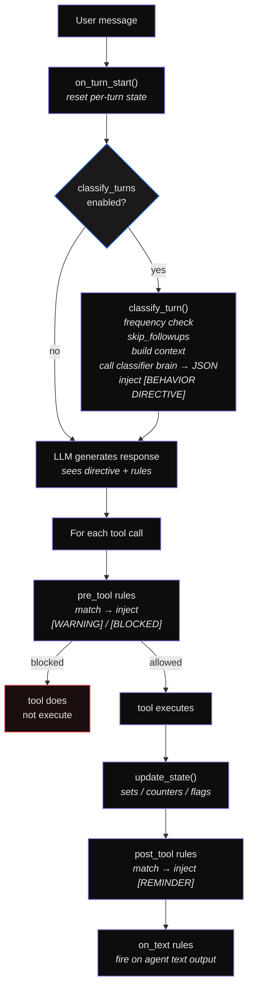

# Behavior Engine

The behavior engine watches every tool call, tracks per-session
state (sets, counters, flags), and acts when a declarative rule
matches - block the call, inject a warning, or drop a post-tool
reminder. An optional **semantic classifier** (a small LLM)
analyses each user message before the main agent acts and
injects behavioural directives.

Nothing about the engine is hard-wired. Rules, what gets
tracked, complexity / approach / risk vocabularies, the
directive format - all driven by YAML. The 14 built-in rules
are themselves declarative definitions you can override by id.

Every claim on this page maps to real code under
 or. Entries are cited with
file + line.

## Where it sits in the YAML

`SecurityBlock.behavior` - the `behavior:`
sub-block lives under the canonical `security:` block:

```yaml
security:
  behavior:
    profile: dev
    classify_turns: true
    rules:
      max_blind_reads: 1
    rule_definitions: [...]
    state_tracking: { ... }
    classifier: { ... }
    brain: { ... }
```

`BehaviorConfig` has `extra: forbid` - typos
fail the compiler.

## Quick start

```yaml
security:
  behavior:
    profile: dev
    classify_turns: true
    rule_definitions:
      - id: backup_before_modify
        trigger: [database.execute]
        when: pre_tool
        action: block
        condition:
          all:
            - param_matches: { param: query, pattern: "(UPDATE|DELETE|DROP)" }
            - flag_is:       { name: backup_created, value: false }
        message: "Create a backup before running '{param:query}'."
    state_tracking:
      flags:
        backup_created:
          set_on: [database.backup]
```

## Bundle directory - `behavior/`

Reusable profiles live in `behavior/<name>.yaml` next to
`prompts/`, `skills/`, etc. The bundle namespace `{{behavior.X}}`
resolves them
([Bundle namespaces](38-bundle-namespaces.md)):

```yaml
security:
  behavior:
    profile: "{{behavior.strict_dev}}"
```

## `BehaviorConfig` fields

 All optional, all `extra: forbid`.

| Field | Type | Default |
|-------|------|---------|
| `profile` | string \| `null` | `null` |
| `rules` | dict[str, bool \| int] | `{}` |
| `custom` | list[`BehaviorCustomRule`] | `[]` |
| `rule_definitions` | list[`BehaviorRuleDefinition`] | `[]` |
| `state_tracking` | `StateTrackingConfig` \| `null` | `null` |
| `classify_turns` | bool | `false` |
| `classifier` | `ClassifierConfig` | `{}` |
| `brain` | `AgentBrain` \| `null` | `null` |
| `use_agent_brain` | bool | `true` |

`profile` accepts a built-in preset name OR a `{{behavior.X}}`
reference. `rules` is the legacy boolean / numeric override
dict; `rule_definitions` is the modern fully-declarative form.
Both compose - declarations win over the boolean flags by id.

## Built-in profiles

 Six presets, each a dict of toggles +
numeric thresholds:

| Profile | Purpose | Notable settings |
|---------|---------|------------------|
| `dev` | Senior-developer discipline. Highest standard. | `max_blind_reads: 2`, `changes_before_test_reminder: 2`, autonomy `medium`, all sequence + delegation + lint rules ON. Injects a 5 KB `DEV_PROMPT_SECTION` into the system prompt. |
| `coding` | Production coding with high autonomy. | Same as `dev` but `web_search_when_unknown: false`, `max_blind_reads: 3`, autonomy `high`. |
| `research` | Read-heavy research workflows. | Disables `read_before_edit` / `test_after_changes` / `verify_after_edit` / `always_lint_check`. Enables `web_search_when_unknown`, `delegate_complex`. `max_blind_reads: 10`. |
| `data` | Data analysis / ETL. | Strict reads + tests + lint, `web_search_when_unknown: true`, `delegate_large_reads: true`, autonomy `medium`. |
| `creative` | Writing / content generation. | Low autonomy, `verbosity: detailed`, `plan_before_execute: true`, `web_search_when_unknown: true`. |
| `assistant` | General-purpose chatbot. | Minimal enforcement: only `read_before_edit`, `read_before_write_existing`, `confirm_destructive`, `web_search_when_unknown`. |

> **`coding` ≠ `dev`.** `coding` is `dev` with `web_search`
> off and slightly looser thresholds. `dev` is the maximally
> opinionated profile and is the one that ships the long
> `DEV_PROMPT_SECTION`.

## Declarative rules - `rule_definitions`

`BehaviorRuleDefinition` (, `extra: forbid`).
Works for any tool, not just filesystem.

```yaml
rule_definitions:
  - id: my_rule                     # unique id
    description: "Human explanation" # injected into the system prompt
    trigger: [edit, write]          # bare name, FQN, or "*"
    when: pre_tool                  # pre_tool | post_tool | on_text
    action: warn                    # block | warn | remind
    condition:
      target_not_in_set: read_files
    message: "You are editing '{target}' without reading it first."
```

| Field | Required | Default | Description |
|-------|----------|---------|-------------|
| `id` | yes | - | Unique id (shown in violation messages). |
| `description` | no | `""` | Injected in the system prompt's behavioural rules block. |
| `trigger` | no | `"*"` | One tool name, list, or `"*"`. Matched flexibly (see below). |
| `when` | no | `pre_tool` | `pre_tool` (before exec) / `post_tool` (after) / `on_text` (on agent text output). |
| `action` | no | `warn` | `block` / `warn` / `remind`. |
| `condition` | no | `{}` | Empty = always fires. See conditions below. |
| `message` | no | `""` | Templated message (placeholders below). |

### Action levels

| Action | Effect | Tool runs? |
|--------|--------|:----------:|
| `block` | `[BEHAVIOR BLOCKED]` injected, tool **prevented**. | no |
| `warn` | `[BEHAVIOR WARNING]` injected, tool runs. | yes |
| `remind` | `[BEHAVIOR REMINDER]` injected after the tool returns. | yes |

### Trigger matching

`_tool_matches` matches case-insensitively across short / FQN /
double-underscore forms:

| Trigger value | Matches |
|---------------|---------|
| `"edit"` | `edit`, `Edit`, `filesystem.edit`, `filesystem__edit` |
| `"filesystem.edit"` | `filesystem.edit`, `edit` |
| `["edit", "write"]` | both |
| `"*"` (or `["*"]`) | every tool |

### Conditions

The 13 condition types:

**State conditions**

| Condition | Behaviour |
|-----------|-----------|
| `target_not_in_set: <set_name>` | Target param value NOT in tracked set. |
| `target_in_set: <set_name>` | Target param value IS in tracked set. |
| `counter_gte: { name, value }` | `state.counters[name] >= value`. |
| `flag_is: { name, value }` | `state.flags[name] == value`. |

**Param conditions**

| Condition | Behaviour |
|-----------|-----------|
| `param_matches: { param, pattern }` | `re.search(pattern, params[param], IGNORECASE)`. |
| `param_contains: { param, value }` | Case-insensitive substring of `params[param]`. |

**Turn conditions**

| Condition | Behaviour |
|-----------|-----------|
| `no_text_before_tools: true` | Agent didn't produce text before the first tool call. |
| `first_tool_this_turn: true` | `state.tool_calls_this_turn == 0`. |
| `consecutive_gte: <N>` | Same tool called `N+` times in a row (counts the upcoming call). |
| `tool_calls_this_turn_eq: <N>` | Exactly N tool calls this turn. |

**Result conditions**

| Condition | Behaviour |
|-----------|-----------|
| `target_exists_on_disk: true` | `os.path.exists(target)`. |
| `text_matches: <pattern>` | Regex on the agent's text (use with `when: on_text`). |
| `result_has_lint_errors: true` | `result.lint` (or `result.data.lint`) has any item with `severity == "error"`. |

**Composite conditions** - short-circuit, freely nestable
():

```yaml
condition:
  all:
    - param_matches: { param: query, pattern: "(UPDATE|DELETE)" }
    - flag_is:       { name: backup_created, value: false }
    - not:
        target_in_set: verified_tables
```

```yaml
condition:
  any:
    - param_contains: { param: command, value: "rm -rf" }
    - param_contains: { param: command, value: "git reset --hard" }
```

Unknown condition keys are logged as
`behavior: unknown condition type: ...` and the rule does **not**
fire. Forward-compatible - an old
daemon never accidentally enforces a rule it doesn't understand.

### Message templates

| Placeholder | Resolves to |
|-------------|-------------|
| `{target}` | Primary target param (file_path / path / url / query / pattern / target). |
| `{tool}` | Bare tool name (`filesystem.edit` → `edit`). |
| `{turn}` | Turn number. |
| `{tool_calls_this_turn}` | Counter for this turn. |
| `{consecutive_same_tool}` | Streak length of identical-tool calls. |
| `{param:<name>}` | A param value (truncated to 100 chars). |
| `{counter:<name>}` | Counter value. |
| `{set_count:<name>}` | Size of a tracked set. |
| `{flag:<name>}` | Flag value (True / False). |

## State tracking - `state_tracking`

`StateTrackingConfig` (, `extra: forbid`).
Three sub-dicts: `sets`, `counters`, `flags`. When the field
is `null`, the engine falls back to defaults derived from the
profile.

### Sets (`StateTrackingSetConfig`)

```yaml
state_tracking:
  sets:
    read_files:
      add_on: [read, filesystem.read]   # tools that add to this set
      target: file_path                  # param name to extract
      aliases: [path, filepath]          # alternative param names
    fetched_urls:
      add_on: [web.fetch]
      target: url
    tables_queried:
      add_on: [database.query, database.execute]
      target: table
```

Rules reference sets via `target_not_in_set` / `target_in_set`
/ `{set_count:X}`.

### Counters (`StateTrackingCounterConfig`)

```yaml
state_tracking:
  counters:
    changes_since_test:
      increment_on: [edit, write]       # +1 on these tools
      reset_on: []                       # reset to 0 on these tools
      reset_when:                        # conditional reset
        tool: bash                       # comma-separated names
        param: command                   # which param to check
        matches: "pytest|npm test"       # regex (re.IGNORECASE)
    queries_since_schema:
      increment_on: [database.query]
      reset_on: [database.schema, database.describe]
```

> **Validator**: a counter without an `increment_on` entry
> raises a validation error
> - counters that never tick are
> rejected at compile time.

### Flags (`StateTrackingFlagConfig`)

```yaml
state_tracking:
  flags:
    backup_created:
      set_on:   [database.backup]   # → True
      unset_on: []                  # → False (optional)
    has_web_searched:
      set_on:   [web.search, search]
    user_confirmed:
      set_on:   [context_builder.ask_user]
```

> **Validator**: a flag without `set_on` raises a
> validation error - same logic as
> counters.

## The 14 built-in rules

`DEFAULT_RULE_DEFINITIONS`. Each
ships as a declarative entry - override any of them by writing
a `rule_definitions` entry with the **same `id`**.

### Sequence rules

| ID | Trigger | When | Action | Effect |
|----|---------|:----:|:------:|--------|
| `read_before_edit` | `edit` | pre | warn | Edit requires the path in `read_files`. |
| `read_before_write_existing` | `write` | pre | warn | Existing file must be read before overwriting. |
| `search_before_read` | `read` | pre | warn | After 3+ blind reads, suggest Grep / Glob. |
| `verify_after_edit` | `edit` | post | remind | Re-read the modified section. |
| `test_after_changes` | `edit`, `write` | post | remind | Run tests after 3+ changes. |

### Prohibition rules

| ID | Trigger | When | Action | Effect |
|----|---------|:----:|:------:|--------|
| `no_bash_for_files` | `bash` | pre | warn | Detects `cat`, `head`, `tail`, `less`, `more`, `bat`, `sed`, `awk`, `perl -p/-i` in commands. |
| `no_blind_exploration` | `bash` | pre | warn | Detects `find .`, `ls -lRa`, `tree`, `dir /s` in commands. |
| `confirm_destructive` | `bash` | pre | **block** | Blocks `rm -rf`, `git reset --hard`, `git push --force`, `git push -f`, `git clean -fd`, `drop table`, `drop database`, `truncate table`. |

### Cognitive rules

| ID | Trigger | When | Action | Effect |
|----|---------|:----:|:------:|--------|
| `plan_before_execute` | `*` | pre | warn | Agent must produce text before the first tool call. |
| `web_search_when_unknown` | `*` | on_text | warn | Detects `not sure / unsure / don't know / uncertain / can't remember` AND `has_web_searched: false`. |
| `delegate_complex` | `*` | post | remind | Fires at exactly 8 tool calls in the turn. |
| `delegate_large_reads` | `read` | post | remind | After 5+ sequential reads. |
| `max_sequential_same_tool` | `*` | pre | warn | Same tool 8 times in a row. |
| `always_lint_check` | `edit`, `write` | post | warn | Tool result has lint errors with `severity: error`. |

### Numeric thresholds

| Parameter | Default | Used by |
|-----------|---------|---------|
| `max_blind_reads` | 3 | `search_before_read` |
| `changes_before_test_reminder` | 3 | `test_after_changes` |
| `max_sequential_same_tool` | 8 | `max_sequential_same_tool` |

```yaml
security:
  behavior:
    profile: dev
    rules:
      max_blind_reads: 1
      changes_before_test_reminder: 1
      max_sequential_same_tool: 5
```

## Custom profile format (`behavior/<name>.yaml`)

```yaml
name: strict_dev
description: "Ultra-strict developer discipline for production code"
extends: dev                 # inherit a built-in preset (optional)

rules:
  max_blind_reads: 1
  changes_before_test_reminder: 1

prompt: |
  You follow strict discipline:
  - NEVER edit a file you haven't read in this session
  - Run tests after EVERY change, no matter how small

custom:
  - id: protect_migrations
    trigger: edit
    when: pre_tool
    action: block
    condition:
      param_contains: { param: file_path, value: "migration" }
    message: "Migration files are protected. Ask the user first."
```

| Key | Description |
|-----|-------------|
| `name` | Display name (shown as the prompt section title). |
| `description` | Passed to the classifier as profile context. |
| `extends` | Inherit from a built-in: `dev`, `coding`, `research`, `data`, `creative`, `assistant`. |
| `rules` | Boolean / threshold overrides merged on top of the base. |
| `prompt` | Custom behavioural instructions injected into the system prompt. |
| `custom` | Legacy custom rules (auto-converted to `rule_definitions`). |

## Semantic classifier - `classifier`

`ClassifierConfig` (, `extra: forbid`). A small
LLM analyses the user message **before** the main agent acts
and emits a `[BEHAVIOR DIRECTIVE]` block injected into the
conversation.

```yaml
security:
  behavior:
    classify_turns: true
    classifier:
      frequency: every_turn        # every_turn | first_turn | every_n_turns | on_new_message
      frequency_n: 3               # for every_n_turns
      skip_followups: true         # skip "ok", "yes", "continue", ...
      timeout: 15                  # seconds
      complexity_levels: [trivial, simple, moderate, complex, critical]
      approaches: [direct, explore_first, plan_and_confirm, delegate, research_first]
      risk_levels: [none, low, medium, high]
      max_directives: 5
      context:
        tool_inventory: true
        session_state: true
        workspace_info: true
        recent_history: true
        history_depth: 8
      system_prompt: null          # null = built-in default
      directive_prefix: "[BEHAVIOR DIRECTIVE - {complexity} complexity, {risk} risk]"
      high_risk_warning: "Risk level: {risk}. Confirm destructive or irreversible actions with the user before proceeding."
      high_risk_threshold: medium
      directive_footer: "Follow these directives. ..."
    brain:
      provider: deepseek
      model: deepseek-chat
      backend: openai_compat
      config: { api_key: "{{secret.DEEPSEEK_API_KEY}}" }
```

### Frequency modes

| Mode | Behaviour |
|------|-----------|
| `every_turn` (default) | Before every agent turn. The classifier may still skip via its own `skip_reason`. |
| `first_turn` | Only the first turn of a session. |
| `every_n_turns` | Every `frequency_n` turns. |
| `on_new_message` | Only when the user actually sent a new message (skip tool-only turns). |

`skip_followups: true` (default) auto-skips simple acknowledgements
like `ok`, `yes`, `continue`, `oui`, `valide` - saves a classifier
LLM call.

### Vocabulary entries (string OR dict)

`complexity_levels`, `approaches`, `risk_levels` accept either
a plain string or a `{name, label, when, behavior}` dict
():

```yaml
# Simple - names only
approaches: [direct, plan_and_confirm, delegate]

# Structured - full control
approaches:
  - name: direct
    label: "Execute directly"
    when: "Task is trivial, clear path"
    behavior: "Go straight to tool calls, minimal text"
  - name: ask_expert
    label: "Needs human expertise"
    when: "Domain knowledge the agent lacks"
    behavior: "Use AskUser, explain what you need to know"
```

| Field | Where it appears |
|-------|-----------------|
| `name` | Value the classifier emits in JSON. |
| `label` | Human-readable string the agent sees in the directive. |
| `when` | Guidance for the classifier on when to pick this. |
| `behavior` | How the agent should behave when this is chosen. |

### Directive format placeholders

Used in `directive_prefix`, `high_risk_warning`,
`directive_footer`:

`{complexity}`, `{approach}`, `{risk}`, `{approach_label}`.

### Custom system prompt

Replace the built-in classifier reasoning model entirely:

```yaml
classifier:
  system_prompt: |
    You decide how the agent should approach each user request.
    Output JSON: {"complexity": "...", "approach": "...", "directives": [...]}
```

Or load from a prompt file (resolved through
[Bundle namespaces](38-bundle-namespaces.md)):

```yaml
classifier:
  system_prompt: "{{prompt.classifier}}"
```

### Classifier brain selection

`brain` picks a separate LLM. When `null`,
the engine reuses the coordinator's brain - unless
`use_agent_brain: false`, in which case classification is
disabled. Tip: a fast / cheap model (haiku, deepseek-chat,
qwen2.5:3b via Ollama) keeps the per-turn latency low.

## Per-session state

Each session gets its own `BhvSessionState` - sets, counters,
flags, recent tool history, turn number, total tool calls,
violations, consecutive-tool counter. Sessions never
cross-contaminate. State is freed when the session ends.

### Snapshot the classifier sees

```text
Turn: 2
Total tool calls: 8
Files read: 3 (recent: src/auth.ts, src/models.ts, src/router.ts)
Edited files: 1 (src/auth.ts)
Changes Since Test: 1
Reads Since Search: 2
Active flags: has_web_searched
Recent actions: grep(auth), read(src/auth.ts), read(src/models.ts), edit(src/auth.ts)
```

The exact contents come straight from the user's
`state_tracking` config - for a database app the lines are
`Tables Queried`, `Queries Since Schema`, etc.

## How enforcement runs



### Priority order

When `rule_definitions` AND legacy `rules` (boolean flags)
both reference the same id, the explicit `rule_definitions`
entry wins. Boolean flags from a profile expand into the
default declarations; a custom `rule_definitions` entry with
the same `id` overrides it. Legacy `custom` rules are
auto-converted into the new format.

## Examples by domain

### Coding assistant

```yaml
security:
  behavior:
    profile: dev
    classify_turns: true
    rules:
      max_blind_reads: 2
      changes_before_test_reminder: 2
    rule_definitions:
      - id: protect_migrations
        trigger: [edit, write]
        when: pre_tool
        action: block
        condition:
          param_contains: { param: file_path, value: "migration" }
        message: "Migration files are protected. Ask the user first."
```

### Database pipeline

```yaml
security:
  behavior:
    classify_turns: true
    classifier:
      complexity_levels:
        - { name: query,     when: "Single SELECT, no side effects",
            behavior: "Execute directly" }
        - { name: transform, when: "UPDATE/INSERT affecting rows",
            behavior: "Verify row count after execution" }
        - { name: migration, when: "ALTER/DROP/CREATE schema changes",
            behavior: "MUST get user approval, run in transaction" }
      approaches:
        - { name: direct,           label: "Execute directly",
            when: "Safe read-only query" }
        - { name: dry_run_first,    label: "Dry-run before executing",
            when: "Bulk data modification",
            behavior: "Run with LIMIT 10 first, then full query" }
        - { name: plan_and_confirm, label: "Plan and get approval",
            when: "Schema changes or data deletion",
            behavior: "Show the SQL plan, wait for user approval" }
      risk_levels:
        - { name: read_only,   when: "SELECT queries" }
        - { name: write,       when: "INSERT/UPDATE operations" }
        - { name: destructive, when: "DELETE/DROP/TRUNCATE",
            behavior: "MUST confirm with user" }
      directive_prefix: "[DATA DIRECTIVE - {complexity}, {risk} risk]"
      high_risk_threshold: write

    rule_definitions:
      - id: backup_before_modify
        trigger: [database.execute]
        when: pre_tool
        action: block
        condition:
          all:
            - param_matches: { param: query, pattern: "(UPDATE|DELETE|ALTER|DROP)" }
            - flag_is:       { name: backup_created, value: false }
        message: "BLOCKED: Create a backup before running '{param:query}'."

      - id: verify_row_count
        trigger: [database.execute]
        when: post_tool
        action: remind
        condition:
          param_matches: { param: query, pattern: "(UPDATE|DELETE)\\s" }
        message: "Verify the affected row count matches expectations."

      - id: no_select_star
        trigger: [database.query]
        when: pre_tool
        action: warn
        condition:
          param_matches: { param: query, pattern: "SELECT\\s+\\*\\s+FROM" }
        message: "Avoid SELECT * - specify columns to reduce data transfer."

      - id: schema_before_query
        trigger: [database.query]
        when: pre_tool
        action: warn
        condition:
          counter_gte: { name: queries_since_schema, value: 3 }
        message: "You ran {counter:queries_since_schema} queries without checking the schema."

    state_tracking:
      sets:
        tables_queried:
          add_on: [database.query, database.execute]
          target: table
      counters:
        queries_since_schema:
          increment_on: [database.query]
          reset_on:     [database.schema, database.describe]
      flags:
        backup_created:
          set_on: [database.backup]
```

### Research team

```yaml
security:
  behavior:
    classify_turns: true
    classifier:
      complexity_levels: [quick, standard, deep]
      approaches:
        - { name: answer_directly,    label: "Answer from knowledge",
            when: "Well-known fact, high confidence",
            behavior: "State the answer with a citation if available" }
        - { name: verify_then_answer, label: "Verify first",
            when: "Probably correct but should double-check",
            behavior: "One quick search, then answer" }
        - { name: multi_source,       label: "Cross-reference sources",
            when: "Conflicting information or evolving topic",
            behavior: "Search 3+ independent sources, compare findings" }
      risk_levels:
        - { name: factual,     when: "Well-established facts" }
        - { name: uncertain,   when: "Evolving field, conflicting sources",
            behavior: "Flag uncertainty, present competing views" }
        - { name: speculative, when: "Predictions, extrapolations",
            behavior: "Label as speculative, never present as fact" }
      directive_prefix: "[RESEARCH - {complexity}, {risk}]"
      directive_footer: "Prioritize accuracy over speed."

    rule_definitions:
      - id: cite_sources
        trigger: [web.fetch]
        when: post_tool
        action: remind
        message: "You fetched a source. Remember to cite it."

      - id: cross_reference
        trigger: [memory.remember]
        when: pre_tool
        action: remind
        condition:
          counter_gte: { name: sources_collected, value: 3 }
        message: "You have {counter:sources_collected} sources. Cross-reference before adding more."

      - id: max_fetches_per_angle
        trigger: [web.fetch]
        when: pre_tool
        action: warn
        condition:
          consecutive_gte: 5
        message: "5 fetches in a row. Synthesize what you have first."

    state_tracking:
      sets:
        fetched_urls:
          add_on: [web.fetch]
          target: url
        search_queries:
          add_on: [web.search]
          target: query
      counters:
        sources_collected:
          increment_on: [web.fetch]
          reset_on:     [memory.remember]
      flags:
        synthesis_done:
          set_on:   [memory.remember]
          unset_on: [web.fetch]
```

## Cross-references

- App-config block reference (`security.behavior` field):
  [App Configuration → security](02-app-config.md#security---runtime-boundaries)
- Hooks system (different mechanism - fires on agent loop
  events vs the behavior engine which fires per-tool):
  [Hooks](31-tool-hooks.md)
- Bundle namespaces (where `{{behavior.X}}` and
  `{{prompt.X}}` resolve from): [Bundle namespaces](38-bundle-namespaces.md)
- The legacy boolean rules dict (`rules:`) maps onto the
  built-in `rule_definitions` list above - the conversion
  lives.
