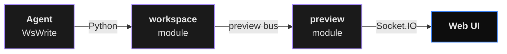

# preview

The **preview** module is Digitorn's universal live-canvas
transport layer. Agents push state, named resources, and
canvas nodes to a per-session stream the client consumes via
Socket.IO. Powers zero-code live previews for builder apps,
React sandboxes, slides, timelines, YAML panels, and any
workflow editor / multi-agent orchestrator.

| Property | Value |
|----------|-------|
| Module id | `preview` |
| Action count | 17 (all `internal=True`) |
| LLM-visible actions | **0** - every action is internal |
| Caller | `workspace` module (in-process), `widget` module |
| Transport | Socket.IO (room `session:{id}`) |
| Isolation | Per-session via `PreviewSessionStore` |

## Architecture



The agent never calls `preview.*` directly - every action is
`internal=True` and stripped from the tool schema sent to the
LLM. The workspace module (and any other shell-layer module)
calls preview as Python methods via its injected
`self._preview` reference:

```python
await self._preview.set_resource(SetResourceParams(
    channel="files",
    id="src/App.tsx",
    payload={"content": "...", "language": "tsx"},
))
```

Per-session isolation handled by `PreviewSessionStore` -
each `session_id` gets its own `PreviewSessionState` with
independent `state`, `resources`, `events` ring buffer, and
monotonic `seq` counter. On reconnect, the client receives a
full `preview:snapshot` replay then resumes on live events.

## The 17 internal actions

### State map (5)

| Action | Params | Purpose |
|--------|--------|---------|
| `set_state` | `key`, `value` | Upsert one scalar. |
| `patch_state` | `patch: dict` | Merge fields into the state map. |
| `get_state` | - | Return full snapshot (state + resources). |
| `clear` | - | Wipe state + resources + events. |
| `emit` | `event_type`, `data` | Push a free-form event. |

### Named resources (6)

Generic channel primitive - channels are dicts keyed by `id`
with arbitrary JSON-serialisable payloads (`files`, `slides`,
`cells`, `nodes`, `edges`, ...).

| Action | Params | Purpose |
|--------|--------|---------|
| `set_resource` | `channel`, `id`, `payload` | Upsert. |
| `patch_resource` | `channel`, `id`, `patch` | Merge fields; create if absent. |
| `delete_resource` | `channel`, `id` | Remove one. |
| `list_resources` | `channel` | Dump every id + payload. |
| `bulk_set_resources` | `channel`, `items: dict[id, payload]`, `replace: bool=False` | Snapshot import. |
| `clear_channel` | `channel` | Drop every resource in a channel. |

### ReactFlow canvas (6)

Thin wrappers over
`set_resource("nodes", ...)` / `set_resource("edges", ...)`.

| Action | Params | Purpose |
|--------|--------|---------|
| `push_node` | `id?`, `type="default"`, `label=""`, `position={x, y}`, `data={}`, `status="idle"` | Add / replace a canvas node. |
| `update_node` | `id`, `updates: dict` | Partial update. Unknown keys merge into `data`. |
| `highlight_node` | `id`, `status: idle\|running\|done\|error` | Shortcut to set node status. |
| `remove_node` | `id` | Drop the node + any touching edges. |
| `push_edge` | `id?`, `source`, `target`, `label=""`, `data={}` | Add / replace an edge. |
| `remove_edge` | `id` | Drop one edge. |

When `push_node.id` is omitted it's auto-derived by slugifying
`label` (fallback `node-{N+1}`). Edge ids default to
`"{source}->{target}"`.

## Socket.IO event types

Every mutation appends a `PreviewEvent` to the session's ring
buffer with an incrementing `seq`, then publishes on the bus
as:

```json
{ "type": "preview:<event_type>", "data": { ...payload, "preview_seq": 42 } }
```

| Event | Emitted by |
|-------|------------|
| `preview:state_changed` | `set_state`. |
| `preview:state_patched` | `patch_state`. |
| `preview:cleared` | `clear`. |
| `preview:resource_set` | `set_resource`, `push_node`, `push_edge`. |
| `preview:resource_patched` | `patch_resource`, `update_node`, `highlight_node`. |
| `preview:resource_deleted` | `delete_resource`, `remove_node`, `remove_edge`. |
| `preview:resource_bulk_set` | `bulk_set_resources`. |
| `preview:channel_cleared` | `clear_channel`. |
| `preview:snapshot` | Server → client on `join_session` (replay). |

Clients use the monotonic `preview_seq` to reconcile after a
reconnect: ask for the snapshot first, then drop any live
event whose `preview_seq <= snapshot.seq`.

## Configuration

The preview module is pure plumbing - no user-facing config.

```yaml
tools:
  modules:
    preview: {}     # just enable it; no config
```

Two attributes are wired in by the daemon bootstrap:

- `preview._event_bus` - the `SocketIOBus` used to publish
  events.
- `preview._bus_app_id` - the app id used as the bus routing
  key.

If either is missing (dev / tests without bus), events are
logged + dropped with a `preview_event_dropped` warning.

## Session isolation

| Hook | Behaviour |
|------|-----------|
| `set_active_session(sid, uid)` | Called by the agent loop before each tool dispatch - binds the next action to this session. |
| `_session` | Resolves to `PreviewSessionState` via the store; creates one on demand. |
| `cleanup_session(sid)` | Drops all state for a session (on session end). |
| `snapshot_for(sid, uid)` | Returns the replay payload used by the Socket.IO `join_session` handler. |

When no active session has been set (dev / tests), a
synthetic `_default_` session is used. In production this
never happens - the agent loop always sets the active
session before dispatching.

## Integration notes

- **Agents never see these tools.** All 17 actions are
  `internal=True` - the schema is never shipped to the LLM.
  Agents manipulate the preview indirectly through
  `workspace.*` (`WsWrite`, `WsRead`, `WsEdit`, `WsGlob`,
  `WsGrep`, `WsDelete`).
- **No SSE.** All streaming moved to Socket.IO; there are no
  fallback HTTP / SSE paths.
- **No legacy workbench.** Every live UI now uses this module.

## Cross-references

- The 6-action workspace facade agents actually call:
  [workspace reference](workspace.md)
- Parallel transport for declarative widgets:
  [widget reference](widget.md)
- Workspace + preview YAML reference:
  [Workspace & Preview](../../language/41-preview.md)
- API integration (Socket.IO defaults, room subscription):
  [API Integration → Real-time](../../language/14-api-integration.md)
