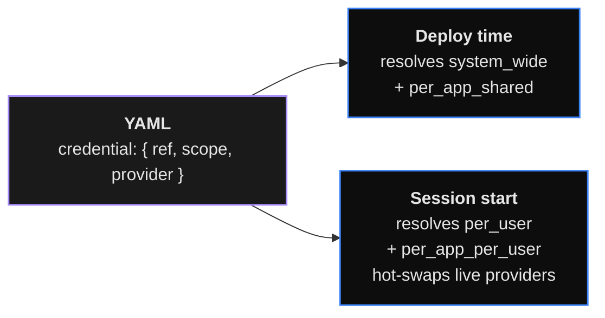

# Credentials

Centralised encrypted vault for all secrets. Apps reference
credentials by name in YAML; users own their secrets in the
vault; the runtime injects the right value at the right
scope, at the right moment. Replaces inline
`{{secret.X}}` / `{{env.X}}` templates (which still work as
a fallback).

## Quick map

| Where | What |
|-------------------------------------------|--------------------------------------------|
| `~/.digitorn/oauth_providers.toml` | OAuth client_id / secret per provider |
| `DIGITORN_MASTER_KEY` (env / file / KMS) | Master encryption key |
| `credentials` table (SQLite / Postgres) | Encrypted vault rows, envelope-encrypted |
| `credential_audit` table | Hash-chained audit log |



## Scopes

Four scopes with different access semantics:

| Scope | Resolved when | Visible to |
|-------|---------------|-----------|
| `system_wide` | deploy | every app, every user |
| `per_app_shared` | deploy | this app, every user |
| `per_user` | session start | this user, every app they own |
| `per_app_per_user` | session start | this user, this app |

OAuth flows are forced to `per_user` (the access token is a
delegation from one specific human user). Lookup is
**scope-strict** - no fallback cascade between scopes.

## YAML reference

Two equivalent shapes:

```yaml
# Compact form (defaults to scope: per_user)
agents:
  - id: assistant
    brain:
      provider: openai
      model: gpt-4o
      backend: openai_compat
      credential: openai_main
```

```yaml
# Explicit form (recommended)
agents:
  - id: assistant
    brain:
      provider: openai
      model: gpt-4o
      backend: openai_compat
      credential:
        ref: openai_main
        scope: per_user
        provider: openai          # optional cross-check
```

`credential.provider` (optional) is a compile-time sanity
check - the daemon verifies the named vault entry's
`provider_name` matches.

## Modules expose slots

A consumer module declares one or more credential slot
configurations at compile time, specifying what type of
credential it accepts, which providers it works with, and
how the fields map to the module's internal config paths.

The compiler walks slots + manifests every consumer block;
the runtime injector reads the mapping to write decrypted
fields at the right path.

## 19 handler types

 (verified):

| Type | Use case |
|------|----------|
| `api_key` | Single-field secret (most LLM providers). |
| `bearer_token` | OAuth-style bearer (GitHub PAT, MCP). |
| `basic_auth` | username + password. |
| `oauth2` | Authorization-code (Google, Slack, Notion, ...). |
| `oauth2_pkce` | Public clients (mobile, CLI). |
| `device_code` | TVs, CLIs, IoT devices. |
| `multi_field` | Generic key / value bag. |
| `connection_string` | DB urls (Postgres, Mongo, Redis, ...). |
| `aws_access_key` | AKID + secret + region. |
| `gcp_service_account` | Service-account JSON. |
| `azure_ad` | Tenant + client + secret. |
| `ssh_key` | Private key + passphrase. |
| `client_certificate` | mTLS cert + key. |
| `mcp_server` | stdio MCP config. |
| `mcp_http` | HTTP MCP url + auth. |
| `hmac_signing_secret` | Webhook signing. |
| `database_fields` | Discrete host / port / user / password. |
| `file_upload` | Up to 10 MB files. |
| `custom` | Schemaless escape hatch. |

Add a handler by implementing the `CredentialHandler` interface.

## Provider catalog (TOML)

Each provider ships a TOML template under 18
builtins shipping today: `anthropic`, `aws`,
`azure_openai`, `deepseek`, `discord_oauth`, `gcp`,
`github_copilot`, `github_oauth`, `github_pat`,
`google_oauth`, `mongodb`, `notion`, `openai`, `postgres`,
`redis`, `slack_oauth`, `stripe`, `mockprovider`.

The TOML overrides handler defaults (icon, display_name,
field labels, verify endpoint) without touching code:

```toml
[provider]
name         = "stripe"
display_name = "Stripe"
handler_type = "multi_field"
icon         = "stripe"
category     = "payments"

[[fields]]
name         = "secret_key"
label        = "Secret key"
prefix_check = "sk_"
required     = true

[verify]
endpoint      = "https://api.stripe.com/v1/balance"
method        = "GET"
auth_template = "Authorization: Bearer {secret_key}"
success_codes = [200]
```

Drop a TOML file in the directory + restart the daemon.

## Security architecture

- **Master key** -
  `DIGITORN_KMS=env|file|aws_kms|gcp_kms|azure_kv|vault`. Default
  is `file` (`~/.digitorn/master.key`) unless `DIGITORN_MASTER_KEY`
  is set in env, which auto-selects `env`. `env` reads
  `DIGITORN_MASTER_KEY` (32 bytes base64url-encoded). Production
  deployments use a real KMS; the data key is wrapped inside each
  row's ciphertext (envelope encryption).
- **Cipher** - AES-256-GCM with a per-record nonce.
  Versioned format: 1-byte version, 1-byte flags, 1-byte
  backend id, 2-byte wrapped-DEK length, then `nonce || ct`.
- **Audit log** - every CRUD + inject + auth flow writes one
  row to `credential_audit`. Rows are chained
  (`prev_hash || this_hash`). Integrity is verified through
  the admin API.
- **Log scrubbing** - every plaintext value is registered
  with the global `LogScrubber` at decryption time.
  Subsequent log lines carrying the value get redacted
  before write.
- **RBAC** - 4 roles (`system_admin`, `app_admin`,
  `app_user`, `viewer`) enforced at the API layer.

## OAuth flow

5 builtin OAuth providers in: Notion, Google,
GitHub, Slack, Discord.

Background refresh loop runs
every 5 minutes and refreshes any credential whose
`expires_at - now < 600 s`. Failures flip the status to
`expired` so the next chat shows the picker dialog.

Revocation in `handlers/oauth2.ts::revoke`.

### MCP stdio token bridging

 For stdio MCP servers, the OAuth
token is injected as an environment variable named in
`auth.env_token_var`, and the subprocess is **restarted**
when the token refreshes. SSE / HTTP MCP servers send the
token in `Authorization: Bearer ...` header on every request.

## API surface

The credentials surface (catalog browsing, vault CRUD, OAuth
start / refresh / status / callback, per-app manifest and
schema, health check, and the admin endpoints) is routed by The full endpoint reference is
not documented publicly. Public clients use the SDK or the
CLI (next section). For direct integration outside of those,
contact your daemon administrator.

## CLI

```bash
digitorn credentials list
digitorn credentials show <id>
digitorn credentials create --provider X -f api_key=sk-...
digitorn credentials delete <id>
digitorn credentials grants <id>                    # list apps that have access
digitorn credentials grant-add <id> <app-id>        # authorize one app
digitorn credentials grant-revoke <id> <app-id>     # revoke; add --hard to delete
digitorn credentials admin-list
digitorn credentials admin-create --provider X -f api_key=sk-...
digitorn credentials admin-delete <id>

Credentials are configured in YAML under `security.credentials_schema`.
```

## Migration from `{{secret.X}}` / `{{env.X}}`

Old apps used inline templates:

```yaml
brain:
  provider: deepseek
  config:
    api_key: "{{env.DEEPSEEK_API_KEY}}"
```

New apps add a `credential:` block (the inline template can
stay as a dev fallback):

```yaml
brain:
  provider: deepseek
  backend: openai_compat
  credential:
    ref: deepseek_main
    scope: per_user
    provider: deepseek
  config:
    api_key: "{{env.DEEPSEEK_API_KEY}}"   # dev-only fallback
```

Run the migrator:

```bash
Credentials migration command rewrites the YAML to use the vault
```

The compiler emits a warning when an app uses templates
without a `credential:` block, pointing at this command.

## Lifecycle states

| State | Meaning |
|-------|---------|
| `filled` | User just stored fields, never verified. |
| `valid` | Passed `test_live_connection` or got a successful refresh. |
| `expired` | TTL hit, refresh failed, or admin marked it. |
| `invalid` | Revoked, or remote rejected the credential. |
| `pending` | OAuth flow in progress. |

## Cross-references

- App-config block reference (`security.credentials_schema`):
  [App Configuration → security](../../language/02-app-config.md)
- API surface (per-app credential routes):
  [API Integration → Credentials](../../language/14-api-integration.md)
- MCP OAuth flow (per-app, MCP server token injection):
  [API Integration → OAuth](../../language/14-api-integration.md)
- Production deployment (KMS choice + master-key
  protection): [Production Deployment](../../language/36-production.md)
