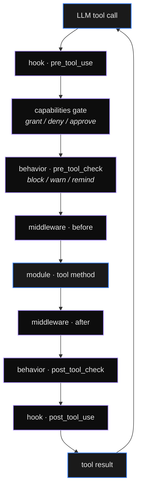

# Runtime reference

Cross-cutting subsystems that touch every app at runtime, but
aren't a single module. This is where you find the behavior of
features that are configured in YAML (`runtime.hooks`,
`runtime.middleware`, `security.credentials_schema`) but executed
by the daemon's runtime layer.

| Page | What it covers |
|------|----------------|
| [Configuration](configuration.md) | Daemon `Settings`: server, KV, database, CORS, sandbox, KMS. Loaded from `/etc/digitorn/config.yaml` < `~/.digitorn/config.yaml` < env vars. |
| [Credentials](credentials.md) | The encrypted vault: scopes (`system_wide`, `per_app_shared`, `per_user`, `per_app_per_user`), 19 handler types, OAuth refresh loop, audit log. |
| [Hooks](hooks.md) | The 15 events, 14 conditions, 13 actions; templating with `{{tool.*}}`; piping tool output to other tools or modules. |
| [Middleware](middleware.md) | The middleware pipeline: built-ins (audit, retry, redact, rate_limit, content_filter) and how to author your own. |
| [Multimodal](multimodal.md) | Image input/output handling, image aging, provider conversion. |
| [Voice](voice.md) | Voice transcription pipeline. |
| [Tool chaining](tool-chaining.md) | The `pipe` hook action - route tool output into the next tool. |

## Where these come together

Every tool call passes through this pipeline, in this order.
Hooks see the result; middleware can transform params and result;
behavior can block before the call or remind after.
