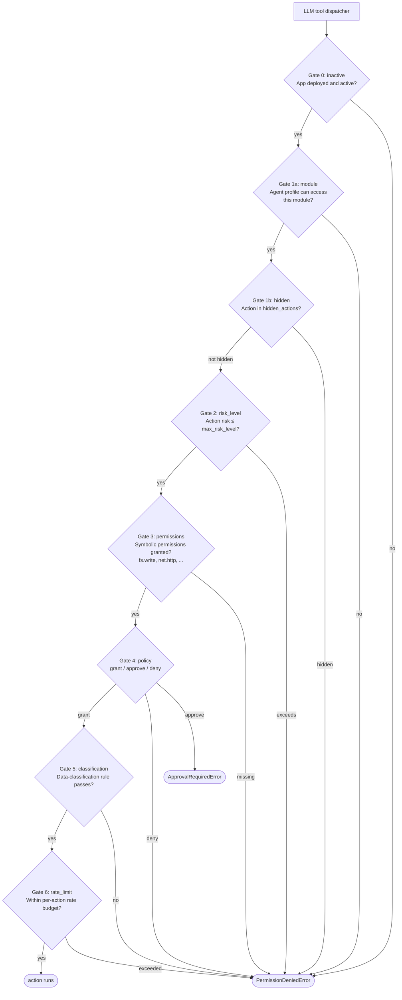

Every tool call in Digitorn passes through a sequence of seven
in-order **security gates**. Each gate has a precise question; the
first gate that says "no" stops the call and stamps the audit log
with its own code (`gate1_module`, `gate4_policy`, …) so a
rejected call is never ambiguous.

This page walks through the gate sequence, explains what each
checks, and demonstrates the most important pattern - **gate 2**,
the risk-level cap - with a real live test.

## The sequence



The first gate that rejects raises `PermissionDeniedError` (or
`ApprovalRequiredError` at gate 4) and the loop returns the
denial as the tool result. Higher-numbered gates only run if every
lower-numbered gate passed.

## What each gate checks

**Gate 0 - inactive.** A trivial check that the app is deployed
and the agent is allowed to run at all. Admin profiles bypass it.
Useful for putting an app into a "soft-undeploy" state without
deleting its bundle.

**Gate 1a - module.** The agent's profile lists which modules it
can call. If the action's module isn't there, the call is blocked.
This is what
[per-agent module restriction](advanced-01-sub-agent-isolation.md)
relies on.

**Gate 1b - hidden.** `tools.capabilities.hidden_actions` lists
actions the agent **cannot** see in its tool index. Different
from `deny`: a hidden action can still be called from setup
steps, hooks, or channel pipelines; it's only invisible to the
LLM.

**Gate 2 - risk level.** Every tool declares a
`risk_level: low | medium | high`. `max_risk_level` caps the
ceiling. Actions above the ceiling are filtered out at schema-build
time, before the LLM ever sees them. **Demonstrated below.**

**Gate 3 - permissions.** Some actions declare symbolic
`required_permissions` (`fs.write`, `net.http`,
`process.spawn`). The agent's profile must grant the matching
permission set. Granular alternative to listing every action by
name.

**Gate 4 - policy.** The big one. Resolves `(module, action)`
against the four-step policy: explicit `deny` → explicit
`approve` → explicit `grant` → app `default_policy`. First match
wins. Approve raises `ApprovalRequiredError` (covered in
[Security 1](security-01-approval.md)).

**Gate 5 - classification.** Per-tool data-classification rule.
If the action declares "this parameter must not contain PII", the
gate scans the params and rejects on hits. Lets you write rules
once and apply them across every call site.

**Gate 6 - rate limit.** Per-action rate window. Bursting past
the limit raises a deny with a `Retry-After` hint. Cheap protection
against a runaway loop calling the same expensive action 1000
times.

## Live demo - gate 2 in action

Save this as `gates-bot.yaml`. The interesting line is
`max_risk_level: medium`: any action with `risk_level: high`
is filtered before the LLM sees it.

```yaml
app:
  app_id: gates-bot
  name: Gates Bot
  version: "1.0"

runtime:
  mode: conversation
  workdir_mode: auto
  max_turns: 4
  timeout: 60

agents:
  - id: main
    role: assistant
    brain:
      provider: deepseek
      model: deepseek-chat
      backend: openai_compat
      credential:
        ref: deepseek_main
        scope: per_user
        provider: deepseek
      config:
        api_key: "{{env.DEEPSEEK_API_KEY}}"
        base_url: https://api.deepseek.com/v1
      temperature: 0
      max_tokens: 200
    system_prompt: |
      You can use Bash and filesystem tools. Be concise. If a
      tool is rejected, report what was rejected and why in one
      sentence.

tools:
  modules:
    shell: {}
    filesystem: {}
  capabilities:
    default_policy: auto
    max_risk_level: medium      # Bash declares risk=high → filtered
    grant:
      - module: filesystem
        actions: [read, glob, grep]
```

The agent loads `shell` and `filesystem` modules, but `max_risk_level:
medium` caps the action surface. The shell module's `bash` action
is `risk_level: high`; the gate-2 enforcement removes it from the
tool index before the LLM gets the schema.

### What the agent reports

User message:

```text
> Run Bash to print "hello". Just call Bash directly.
```

Real reply captured against the daemon:

```text
I don't have a `shell.bash` tool available. The tools I have
access to are filesystem tools only: Read, Write, Edit, Glob,
Grep, and the orchestration tools `background_run` and
`run_parallel`. There's no Bash/shell execution tool in my
current toolset, so I can't run `echo hello` directly.
```

Two things to notice.

First, the agent did not get the chance to *try* `Bash`. The gate
2 filter ran at schema-build time, so the model literally saw
"shell.bash" missing from its tool list. There is no tool-call
event in the session log because there was no tool call to make.

Second, this is more **secure than runtime rejection**. A runtime
rejection means the model saw an attractive tool, tried to call
it, and got told no. With enough wiggle room, models occasionally
chain attempts that succeed. A schema filter denies the model
the choice in the first place.

## Why each gate exists

Gates 0-1 are the **deployment surface**: is this app
running, can this agent access this module, is this action hidden?

Gate 2 is the **risk ceiling**: a coarse cap that says "no high-risk
actions in this tier", regardless of which specific actions you
remembered to list. New high-risk actions added to the toolbox
later are auto-blocked.

Gate 3 is the **permission system**: symbolic permissions
(`fs.write`, `net.http`) instead of action enumeration. A new
action that declares the right permission auto-inherits the
right access without app YAML changes.

Gate 4 is the **policy resolver**: the explicit grant / approve /
deny decisions, with `default_policy` as the catch-all. This is
where the action actually clears or pauses (approve) or fails
(deny).

Gate 5 is **content-aware**: it can inspect parameters and reject
on data shape, not just identifier. Good for "no email addresses
in log calls", "no PII in third-party tool calls".

Gate 6 is **flow control**: stops a runaway loop from burning
budget on the same action.

## Composing the gates

A typical production app uses three of the seven and ignores the
rest:

- `default_policy: block` plus explicit `grant`s (gate 4)
- `max_risk_level: medium` so future high-risk additions are
  auto-blocked (gate 2)
- `approve:` on the actions where a human must always confirm
  (gate 4 with approval branch)

Gates 0, 1b, 3, 5, 6 mostly stay default. Reach for them when:

- An action you depend on changes risk class without warning
  (raise `max_risk_level` or move it to `grant`).
- You want to **expose** an action only to setup pipelines,
  not the LLM (move it to `hidden_actions`).
- You want the agent to obey **classification** rules (PII,
  HIPAA, secrets in messages) - declare gate-5 rules.
- You're running a public-facing app and want **per-user rate
  limits** on expensive tools (gate 6).

## Going further

- Full security architecture, including the schema for each gate:
  [Security architecture](../language/11-security.md).
- The audit log every gate writes to:
  [Observability - Audit log](../language/24-observability.md#audit-log).
- The OS-level sandbox layer (Landlock, seccomp, Job Objects)
  that complements the application-level gates:
  OS Sandbox.
- The **approval flow** when gate 4 chooses `approve`:
  [Security 1 - Human-in-the-loop approval](security-01-approval.md).
